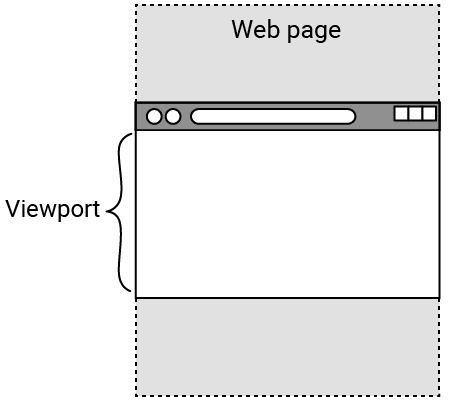
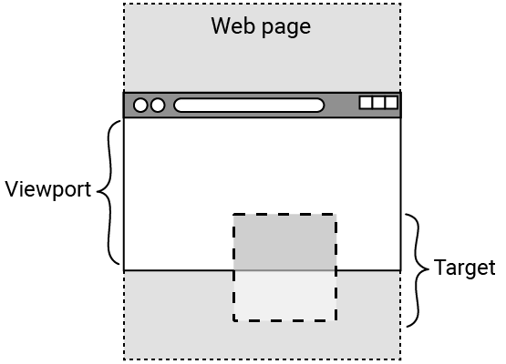

## Observe elements

In this step, you will use the 'intersection observer' to make some text disappear!

<iframe src="https://editor.raspberrypi.org/en/embed/viewer/animated-story-step2" width="100%" height="800" frameborder="0" marginwidth="0" marginheight="0" allowfullscreen> </iframe>

--- task ---

Open the [Animated story starter project](https://editor.raspberrypi.org/en/projects/animated-story-starter){:target="_blank"}.

--- /task ---

Your starter project contains:
+ `index.html`: an HTML page with images and text 
+ `style.html` and `default.css`: CSS files that contain styling for some of the content 
+ The images you will use in the project
+ `scripts.js`: a JavaScript file that you will develop throughout the project

### Console

--- task ---

Open the Console.

**Tip:** Most browsers will let you right-click on a page and 'Inspect' an element. 

This opens developer tools, including the Console.

Some helpful keyboard shortcuts:

+ Chrome: Ctrl + Shift + J (on Windows) or Cmd + Option + J (on a Mac)
+ Firefox: Ctrl + Shift + J (on Windows) or Cmd + Option + K (on a Mac)
+ Microsoft Edge: Control + Shift + I
+ Safari: First, enable the 'Develop menu'. To do this, click **Safari** in the Mac menu bar and select **Settings**. Click on **Advanced**, tick the checkbox next to 'Show features for web developers' and then close the window. You can now open the console using Cmd + Option + C.

--- /task ---

A JavaScript observer can be used to watch ('observe') a collection of HTML elements with a specific `id` or `class` attribute. 

A collection of items is called an **array**. An array can contain multiple items or just a single item.

One use of an observer is to let the browser detect when an element enters the viewport.

The **viewport** is the area of the webpage that is currently visible in the browser.

You can output something to the Console to see if your observer is working.

### Create an intersection observer called bounceObserver

--- task ---

Open the `scripts.js` file.

Create an observer called `bounceObserver`.

--- code ---
---
language: js
filename: scripts.js
line_numbers: true
line_number_start: 1
line_highlights: 2-4
---

// Hide bounce observer
const bounceObserver = new IntersectionObserver(

);

// Image observer

--- /code ---

**Tip:** Separate the different observers using a line break (in this case, on line 5).

--- /task ---

### Tell bounceObserver to observe

--- task ---

Call `bounceObserver` to `observe` the element in the `document` (webpage) with the attribute `id="hideBounce"`. 

**Note:** This element is called the 'target' element.

Observed elements are passed to the `entries` array in the observer.

--- code ---
---
language: js
filename: scripts.js
line_numbers: true
line_number_start: 1
line_highlights: 2, 5
---

// Hide bounce observer
const bounceObserver = new IntersectionObserver((entries)
  
);
bounceObserver.observe(document.querySelector("#hideBounce"));

// Image observer

--- /code ---

**Note:** The line break on line 3 will contain the callback.

 The **callback** is the code that runs when the browser detects ('observes') a target element.

--- /task ---

### Create the callback

--- task ---

Arrow syntax (`=>`) can be used instead of the `function` keyword.

--- code ---
---
language: js
filename: scripts.js
line_numbers: true
line_number_start: 1
line_highlights: 2, 4
---

// Hide bounce observer
const bounceObserver = new IntersectionObserver((entries) => {

});
bounceObserver.observe(document.querySelector("#hideBounce"));

// Image observer

--- /code ---

--- /task ---

The callback will start by checking `if` the element in the `entries` array (with the attribute `id="hideBounce"`) (the target element) has entered the viewport.

The `isIntersecting` method is used to check this.

This image shows a target element on a webpage that has entered the browser's viewport.

--- task ---

Start the callback with a conditional statement.

--- code ---
---
language: js
filename: scripts.js
line_numbers: true
line_number_start: 1
line_highlights: 3-5
---

// Hide bounce observer
const bounceObserver = new IntersectionObserver((entries) => {
  if (entries[0].isIntersecting) {

  }
});
bounceObserver.observe(document.querySelector("#hideBounce"));

// Image observer

--- /code ---
 
**Tip:** There is only one element in the entries array (at index 0). Therefore, you can access it directly using `entries[0]`.

--- /task ---

### Output a message to the Console

If the condition is met (the element with the attribute `id="hideBounce"` has entered the viewport), you can output a message to the Console for testing using `console.log()`.

--- task ---

Add an action when the `if` condition is met that outputs a test message to the Console.

--- code ---
---
language: js
filename: scripts.js
line_numbers: true
line_number_start: 1
line_highlights: 4
---

// Hide bounce observer
const bounceObserver = new IntersectionObserver((entries) => {
  if (entries[0].isIntersecting) {
    console.log("BOUNCE TRIGGER IN VIEWPORT");
  }
});
bounceObserver.observe(document.querySelector("#hideBounce"));

// Image observer

--- /code ---
 
**Click Run**
+ Open the Console.
+ Scroll down and see the message "BOUNCE TRIGGER IN VIEWPORT" appear in the Console.

--- /task ---

--- collapse ---

---
title: Nothing appears in the Console
---
+ Check your spelling of `IntersectionObserver`. It should have two capital letters.
+ There must be a semicolon at the end of lines 4, 6, and 7.
+ Close all your brackets and curly braces.
  
--- /collapse ---

--- collapse ---

---
title: The structure of the bounceObserver intersection observer
---

On line 2, `entries` is a collection of all elements on the webpage with the `id="hideBounce"` attribute. 

A collection of items is called an 'array'.

The `bounceObserver` is set to observe when the first (in this case, the only) target element in the `entries` array enters the viewport.

When it does, the observer 'callback' outputs a message to the Console.

--- /collapse ---

### Hide text

The index page has some bouncing text at the bottom telling you to 'SCROLL DOWN'.

--- task ---

**Test:** Scroll down. 

You will see that the 'SCROLL DOWN' text gets in the way of other content. 

--- /task --- 

You can do more than output messages to the Console.

You can hide the bouncing 'SCROLL DOWN' text, by changing the value of its `opacity` property.

--- task ---

Add an action when the `if` condition is met that changes the value of the `opacity` property of the bouncing text element, which has the attribute `id="bounce"`.

Set the opacity value to `0` to make it invisible.

--- code ---
---
language: js
filename: scripts.js
line_numbers: true
line_number_start: 1
line_highlights: 5
---

// Hide bounce observer
const bounceObserver = new IntersectionObserver((entries) => {
  if (entries[0].isIntersecting) {
    console.log("BOUNCE TRIGGER IN VIEWPORT");
    document.querySelector("#bounce").style.opacity = 0;
  }
});
bounceObserver.observe(document.querySelector("#hideBounce"));

// Image observer

--- /code ---

--- /task ---

--- task ---

**Click Run**
+ Scroll down to see the bouncing text 'SCROLL DOWN' disappear!
  
--- /task ---

--- collapse ---

---
title: The bouncing text does not disappear
---
+ There must be a semicolon at the end of line 5.
+ Make sure you spell `querySelector` correctly, including the capital letter!

--- /collapse ---

## Save your project

Your project is saved automatically. Return to the starter link in the same web browser to see your changes. 

Next, you are going to improve browser performance by only loading images when they are needed.
