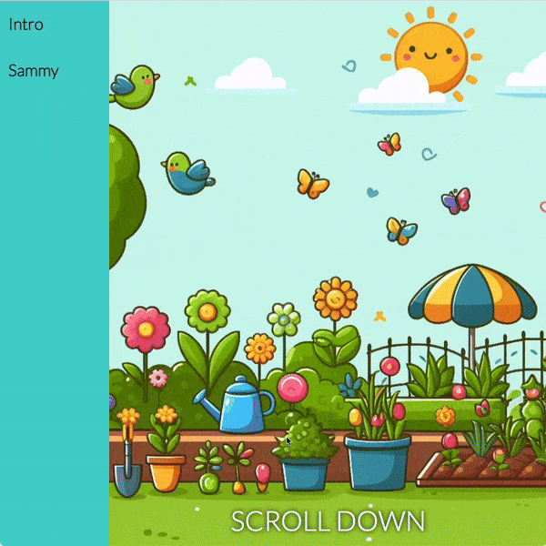

## Animate text

In this step you will add a cool animation to the text to grab people's attention!

<iframe src="https://editor.raspberrypi.org/en/embed/viewer/animated-story-step5" width="100%" height="800" frameborder="0" marginwidth="0" marginheight="0" allowfullscreen> </iframe>

### Fix the position of the garden image

You can 'fix' the position of the garden image so it appears as a background, with other content scrolling in front of it.

--- task ---

Add the `background-attachment: fixed` property to the `.garden` selector.

--- code ---
---
language: css
filename: style.css
line_numbers: true
line_number_start: 75
line_highlights: 79
---

.garden {
  background-image: url("garden.jpeg");
  background-size: cover;
  background-position-y: bottom;
  background-attachment: fixed;
}

--- /code ---

**Click Run**
+ Scroll down to see the garden image as a fixed background.

--- collapse ---

---
title: What should I see?
---

--- /collapse ---

--- /task ---

### Add a heading

You can add a heading for the story page using an `<h1>` element.

The `<h1>` element should have the attribute `id="hideBounce"`.

--- task ---

Open the `sammy.html` file.

Find the closing `</section>` tag.

Add an `<h1>` element. 

--- code ---
---
language: html
filename: sammy.html
line_numbers: true
line_number_start: 16
line_highlights: 20
---

    <main>
      <section class="garden">
        
SCROLL DOWN

      </section>
      <h1 id="hideBounce">Sammy  The Snail</h1>
    </main>

--- /code ---

**Click Run**
+ Scroll down to see the heading.

--- /task ---

### Add some story text

--- task ---

Add the story text after the `<h1>` heading.

The story text should be in a `
` element.

--- code ---
---
language: html
filename: sammy.html
line_numbers: true
line_number_start: 16
line_highlights: 21-23
---

    <main>
      <section class="garden">
        
SCROLL DOWN

      </section>
      <h1 id="hideBounce">Sammy  The Snail</h1>
      

        On a bright and sunny day in the garden, Sammy the Snail woke up feeling curious.   His shiny shell glistened as he slowly ventured beyond his usual path. Sammy wanted to see what lay beyond the familiar leaves and flowers.   As he slid along, the tiny garden world seemed to unfold before him.   Sammy discovered a patch of dew-kissed grass, sparkling like diamonds in the morning sun. Excitement filled him as he explored tiny tunnels and secret hideaways.  The little snail's adventure brought a smile to his face. Sammy realised that even in the smallest corners of the garden, there were secrets to be found.   Sammy continued his exploration, eager to uncover more wonders in this blossoming world.
      

    </main>

--- /code ---

**Click Run**
+ Scroll down to see the story text.

--- /task ---

### Animate the text 

Create an animation to apply to the story text.

--- task ---

Open the `style.css` file.

Find the `/* ANIMATIONS */` comment.

Add a keyframes animation called `rising`.

--- code ---
---
language: css
filename: style.css
line_numbers: true
line_number_start: 51
line_highlights: 53-61
---

/* ANIMATIONS */

@keyframes rising {
  from {
    transform: translateY(20%);
  }
  to {
    transform: translateY(0%);
  }
}

@keyframes bounce {

--- /code ---

--- /task ---

Next, create a new selector (`.rise`) that uses the `rising` animation.

**Note:** Later, you will use JavaScript to add the `rise` class to the `
` element when it enters the viewport.

--- task ---

Create the `.rise` selector.

--- code ---
---
language: css
filename: style.css
line_numbers: true
line_number_start: 51
line_highlights: 53-56
---

/* ANIMATIONS */

.rise {
  animation: rising 2s ease;
}

@keyframes rising {

--- /code ---

The selector has one `animation` property set to call the keyframes animation `rising` that you created earlier. 

The animation is set to last for two seconds (`2s`) and use the `ease` transition.

**Tip:** You can add this anywhere in the CSS file, but it makes sense to add it close to the code for the keyframes animation.

--- /task ---

### Use JavaScript to trigger the animation

This animation will not be required on `index.html`.

You should create a new JavaScript file with scripts required by this page.

--- task ---

Create a new JavaScript file that will contain the scripts relevant to `sammy.html`.

+ **Click** the '+ Add file' button

+ Name your new file `sammy.js` and click the 'Add file' button.

--- /task ---

You need to link your new file from the `sammy.html` page.

--- task ---

Open the `sammy.html` file.

Find the `
  

--- /code ---

--- /task ---

You will now create a JavaScript intersection observer with a callback that adds the `rise` class to the `
` element when it enters the viewport.

--- task ---

Open the file `sammy.js` you created earlier.

Add an intersection observer called `riseObserver`.

--- code ---
---
language: js
filename: sammy.js
line_numbers: true
line_number_start: 1
line_highlights:
---

// Rising text observer
const riseObserver = new IntersectionObserver((entries) => {
  if (entries[0].isIntersecting) {
    entries[0].target.classList.add("rise");
  }
});
riseObserver.observe(document.querySelector("p"));

--- /code ---

**Tip:** This intersection observer is similar to `bounceObserver` that you created in an earlier step. 

There are two main differences:

+ `riseObserver` watches for `
` elements
+ `riseObserver` adds the `rise` class to intersecting elements.

**Click Run**
+ Scroll down to see the rising animation when the `
` text enters the viewport.

--- /task ---

Next you will add an animation to the heading and a different animation to an image.