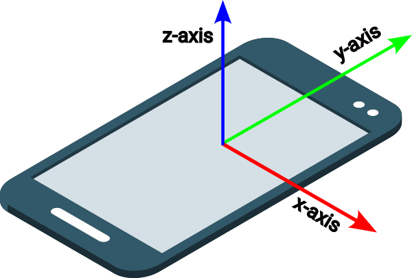

## Animate the story

In this step you will animate the heading and an image.

<iframe src="https://editor.raspberrypi.org/en/embed/viewer/animated-story-complete" width="100%" height="800" frameborder="0" marginwidth="0" marginheight="0" allowfullscreen> </iframe>

### Create a trigger

An empty `
` element can be used to trigger an animation.

--- task ---

Open the `sammy.html` file.

Add a `
` element above the `<h1>` element and give it the attribute `id="headingTrigger"`.

--- code ---
---
language: html
filename: sammy.html
line_numbers: true
line_number_start: 19
line_highlights: 20
---

      </section>
      

      <h1 id="hideBounce">Sammy  The Snail</h1>

--- /code ---

--- /task ---

### Toggle the animation

An intersection observer can be used to watch for the `id` you just added to the empty `
`.

If the `
` **leaves** the viewport, the callback adds the `enabled` class to the `<h1>` element.

The `.enabled` selector styles the colours for the heading's font and background. It also sets a `position: sticky` property, so the heading stays in its current location (at the top) when the `enabled` class is added.

The toggle method is used to turn the effect on or off as the target element (the empty `
`) leaves and enters the viewport.

--- task ---

Open the `sammy.js` file.

Create an intersection observer called `headingObserver`.

--- code ---
---
language: js
filename: sammy.js
line_numbers: true
line_number_start: 9
line_highlights:
---

// Heading observer
const headingObserver = new IntersectionObserver((entries) => {
  document.querySelector("h1").classList.toggle("enabled", !entries[0].isIntersecting);
});
headingObserver.observe(document.querySelector("#headingTrigger"));

--- /code ---

**Click Run**
+ Scroll down to see the heading stick and change colour when it reaches the top.

--- collapse ---

---
title: The heading does not stick when it reaches the top
---
+ Make sure you have `!` before `entries[0].isIntersecting`.
  
--- /collapse ---

--- collapse ---

---
title: Why does the text go behind the heading?
---

In CSS, `z-index` is a property that controls the layer order of elements on the z-axis (the axis that comes out of the screen towards the viewer). 

You can use the `z-index` property to make elements appear in front of or behind each other. 

Find the `h1` selector in the `style.css` file. 

--- code ---
---
language: css
filename: style.css
line_numbers: true
line_number_start: 18
line_highlights: 27
---

h1 {
  margin: 0;
  color: var(--main-color);
  background-color: var(--background-color);
  top: 0;
  left: 1rem;
  padding-left: 2rem;
  line-height: 2;
  margin-top: 1px;
  z-index: 1;
  transition: all 300ms;
}

--- /code ---

The selector styles the heading so its z-index is `1`, meaning it's z-index is higher than the other elements', (which are set to `0` by default) meaning it appears in front of them, on the top layer.

**Test:** 

+ Set the `z-index` property of the `h1` selector to `-1`. 

**Click Run**
+ Scroll down to see the story text appear in front of the heading. 
+ Set z-index back to `1` when you are finished testing.

--- /collapse ---

--- /task ---

--- collapse ---

---
title: Using the logical not operator
---

The logical not `!` operator is used with the `isIntersecting` method in the callback, so the `enabled` class is only added when the div is **not** in the viewport.

--- /collapse ---

### Add an image for the character

This page is about one of the story characters: Sammy the snail.

You can add an image of Sammy to the page.

You first need a background for Sammy.

--- task ---

Open the `sammy.html` file.

Add a new `<section>` element with the attribute `class="garden"`. 

--- code ---
---
language: html
filename: sammy.html
line_numbers: true
line_number_start: 24
line_highlights: 25-27
---

      

      <section class="garden">
        
      </section>

--- /code ---

--- /task ---

Add the snail image.

--- task ---

Add an `` element with the attributes `id="snail"`, `class="snail"` and alt text to improve accessibility.

--- code ---
---
language: html
filename: sammy.html
line_numbers: true
line_number_start: 26
line_highlights: 28
---

      

      <section class="garden">
        
      </section>
    </main>

--- /code ---

--- /task ---

--- collapse ---

---
title: Why are 'src' and 'data-src' both set to 'snail.svg'?
---

The `src` and `data-src` attribute values are the same, because `imageObserver` will act on this `` element, but we do not want the image to change.

--- /collapse ---

### Style the character image

The image of Sammy will appear from the left and move to the middle. It will also 'fade in'.

--- task ---

Open the `style.css` file.

Find the `/* SNAIL */` comment.

Add the `.snail` selector.

--- code ---
---
language: css
filename: style.css
line_numbers: true
line_number_start: 95
line_highlights: 97-106
---

/* SNAIL */

.snail {
  opacity: 0;
  transform: translateX(-20%);
  transition: all 2s ease-out;
  height: 20vh;
  margin-top: 80vh;
  position: relative;
  padding-left: 0;
}

/* NAV BAR */

--- /code ---

--- collapse ---

---
title: How is the image styled?
---

The `.snail` selector styles the image with `0` opacity, making it invisible. It also moves the image left to 25% of the width of its parent element.

Its height is styled to be 20% of the viewport height (`20vh`). This means it will resize as the browser window height changes.

--- /collapse ---

--- /task ---

### Show and move the character image

To animate the image, it will change its opacity to 1, making it fully visible. It will also move right by 25% of its own width.

--- task ---

Add the `.startCrawl` selector.

--- code ---
---
language: css
filename: style.css
line_numbers: true
line_number_start: 95
line_highlights: 107-111
---

/* SNAIL */

.snail {
  opacity: 0;
  transform: translateX(-20%);
  transition: all 2s ease-out;
  height: 20vh;
  margin-top: 80vh;
  position: relative;
  padding-left: 0;
}

.startCrawl {
  opacity: 1;
  transform: translateX(25%);
}

/* NAV BAR */

--- /code ---

--- /task ---

### Trigger the startCrawl animation

This intersection observer will watch for an element with the attribute `id="snail"`.

If the element enters the viewport (`isIntersecting`), the callback adds the `startCrawl` class to the element.

--- task ---

Open the `sammy.js` file.

Create an intersection observer called `snailObserver`.

--- code ---
---
language: js
filename: sammy.js
line_numbers: true
line_number_start: 15
line_highlights:
---

// Snail observer
const snailObserver = new IntersectionObserver((entries) => {
  if (entries[0].isIntersecting) {
    entries[0].target.classList.add("startCrawl");
  }
});
snailObserver.observe(document.querySelector("#snail"));

--- /code ---

**Click Run**
+ Scroll down to see the snail animation when it enters the viewport.

--- /task ---

### Set a threshold

Options can be added to the observer, so it only triggers when a percentage of the element is intersecting.

--- task ---

Add an option to the observer, so it only triggers the callback when all of the snail image is in the viewport.

--- code ---
---
language: js
filename: sammy.js
line_numbers: true
line_number_start: 15
line_highlights: 20-22
---

// Snail observer
const snailObserver = new IntersectionObserver((entries) => {
  if (entries[0].isIntersecting) {
    entries[0].target.classList.add("startCrawl");
  }
},
{ threshold: 1 }
);
snailObserver.observe(document.querySelector("#snail"));

--- /code ---

--- collapse ---

---
title: What are the 'threshold' options?
---

Threshold values range from `0` to `1` 
`1` means that every single pixel of the element has to be in the viewport for the callback to run. 
`0` is the default value and means that just one pixel must be intersecting for the callback to run.

--- /collapse ---

**Click Run**
+ Scroll down to see that the the animation only starts when the whole image is in the viewport.

--- /task ---