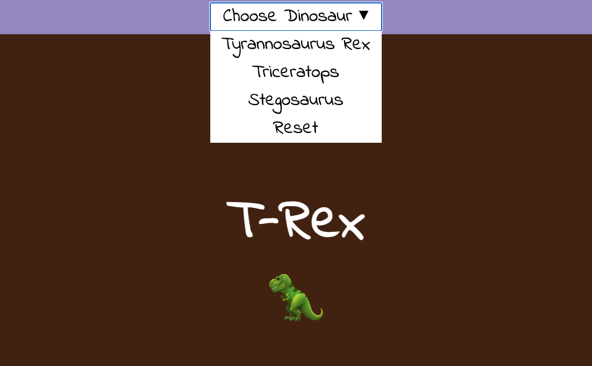

## What next?

If you are following the [More web](https://projects.raspberrypi.org/en/raspberrypi/more-web) path, you can move on to the [Pick your favourite!](https://projects.raspberrypi.org/en/projects/pick-your-favourite) project. In this project, you will create a fan website that lets a user make choices that change the content of the webpage! You could make a webpage with content about different sports teams, fashion brands, TV shows, or anything else you and your friends are fans of!

--- print-only ---

--- /print-only ---

--- no-print ---

<iframe src="https://editor.raspberrypi.org/en/embed/viewer/pick-your-favourite-complete" width="100%" height="800" frameborder="0" marginwidth="0" marginheight="0" allowfullscreen> </iframe>

--- /no-print ---

If you want to have more fun exploring HTML, CSS, and JavaScript, then you could try out any of [these projects](https://projects.raspberrypi.org/en/projects?software%5B%5D=html-css-javascript).
