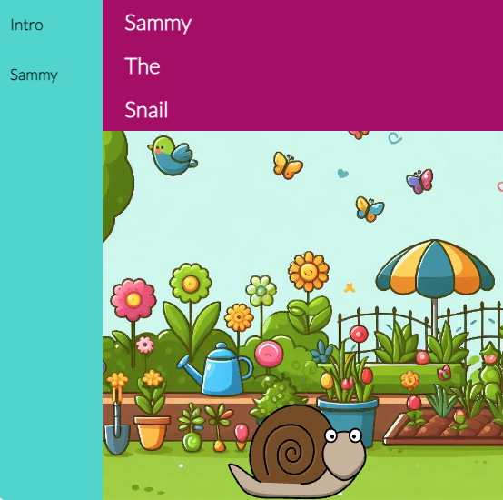

## Introduction

Dans ce projet, tu utiliseras HTML, CSS, et JavaScript pour créer une histoire interactive avec du texte animé et des personnages qui sont déclenchés lorsque l'utilisateur fait défiler.

Les pages web étaient autrefois statiques et ennuyeuses, mais les sites web modernes ajoutent de l'**interaction** pour attirer l'attention du spectateur et rendre l'expérience en ligne plus amusante et intéressante. 

Tu vas :

- Suivre la position des éléments
- Configurer les images pour qu'elles se chargent uniquement lorsqu'elles sont nécessaires
- Créer ta propre page HTML
- Animer les éléments de texte et d'image lorsqu'ils apparaissent

\--- no-print ---

\--- task ---

### Essaie-le

  
Découvre cette histoire animée. 

- Fais défiler la page vers le bas pour regarder le chargement des images
- Clique sur les liens de la barre de navigation latérale pour accéder aux différentes pages
- Fais défiler la page vers le bas pour voir les différentes fonctionnalités interactives

<iframe src="https://editor.raspberrypi.org/en/embed/viewer/animated-story-complete" width="100%" height="800" frameborder="0" marginwidth="0" marginheight="0" allowfullscreen> </iframe>

\--- collapse ---

---

## title: Images dans ce projet

Image de jardin créée à l'aide de l'IA générative. Modèle : Firefly Image 2
Image d'abeille par Clker-Free-Vector-Images via Pixabay.
Image de libellule par pixelcreatures via Pixabay.
Image de papillon par MahuaSarkar via Pixabay.
Image de coccinelle par Glamazon via Pixabay.
Image d'escargot : Freeimages.com/openclipart.org
Image de spinner : Iphone-spinner-2 via https://icons8.com/

\--- /collapse ---

\--- /task ---

\--- /no-print ---

\--- print-only ---

\--- /print-only ---
