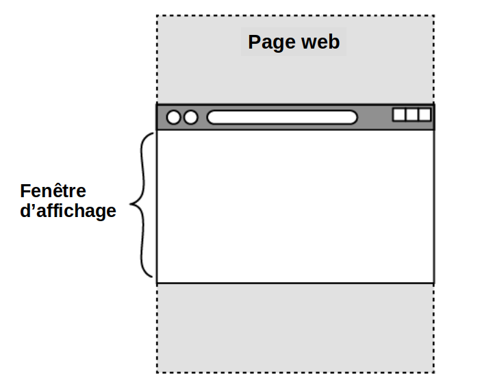

## Observer les éléments

Dans cette étape, tu utiliseras « l’Intersection Observer » pour faire disparaître du texte !

<iframe src="https://editor.raspberrypi.org/fr-FR/embed/viewer/animated-story-step2" width="100%" height="800" frameborder="0" marginwidth="0" marginheight="0" allowfullscreen> </iframe>

--- task ---

Ouvre le [projet de démarrage Histoire animée](https://editor.raspberrypi.org/fr-FR/projects/animated-story-starter){:target="_blank"}.

--- /task ---

Ton projet de démarrage contient :

- `index.html` : une page HTML avec des images et du texte
- `style.html` et `default.css` : fichiers CSS qui contiennent le style de certains contenus
- Les images que tu utiliseras dans le projet
- `scripts.js`: un fichier JavaScript que tu vas développer tout au long du projet

### Console

--- task ---

Ouvre la console.

**Astuce :** la plupart des navigateurs te permettent de cliquer avec le bouton droit sur une page et d'« inspecter » un élément.

Cela ouvre les outils de développement, y compris la console.

Quelques raccourcis clavier utiles :

- Chrome : Ctrl + Maj + J (sur Windows) ou Cmd + Option + J (sur Mac)
- Firefox : Ctrl + Maj + J (sur Windows) ou Cmd + Option + K (sur Mac)
- Microsoft Edge : Ctrl + Maj + I
- Safari : Tout d'abord, active le menu « Développer le menu ». Pour ce faire, clique sur **Safari** dans la barre de menus Mac et sélectionne **Paramètres**. Clique sur **Avancé**, coche la case à côté de « Afficher les fonctionnalités pour les développeurs web », puis ferme la fenêtre. Tu peux maintenant ouvrir la console en utilisant Cmd + Option + C.

--- /task ---

Un observateur JavaScript peut être utilisé pour surveiller (« observer ») une collection d'éléments HTML avec un `id` spécifique ou un attribut `class`.

Une collection d'éléments est appelée un **tableau**. Un tableau peut contenir plusieurs éléments ou juste un seul élément.

L’une des utilisations d’un observateur est de permettre au navigateur de détecter lorsqu’un élément entre dans la fenêtre d’affichage.

La **fenêtre d'affichage** est la zone de la page web qui est actuellement visible dans le navigateur.

Tu peux afficher quelque chose dans la console pour voir si ton observateur fonctionne.

### Créer un Intersection Observer appelé bounceObserver

--- task ---

Ouvre le fichier `scripts.js`.

Crée un observateur appelé `bounceObserver`.

--- code ---
---
language: js
filename: scripts.js
line_numbers: true
line_number_start: 1
line_highlights: 2-4
---

// Masquer le bounce observer
const bounceObserver = new IntersectionObserver(

);

// Observateur d'image

--- /code ---

**Astuce :** sépare les différents observateurs à l’aide d’un saut de ligne (dans ce cas, sur la ligne 5).

--- /task ---

### Dire à bounceObserver d'observer

--- task ---

Appelle `bounceObserver` pour `observer` l'élément dans le `document` (page web) avec l'attribut `id="hideBounce"`.

**Remarque :** cet élément est appelé élément « cible ».

Les éléments observés sont transmis au tableau `entries` dans l'observateur.

--- code ---
---
language: js
filename: scripts.js
line_numbers: true
line_number_start: 1
line_highlights: 2, 5
---

// Masquer le bounce observer
const bounceObserver = new IntersectionObserver((entries)

);
bounceObserver.observe(document.querySelector("#hideBounce"));

// Observateur d'image

--- /code ---

**Remarque :** le saut de ligne sur la ligne 3 contiendra le rappel.

 Le **callback** est le code qui s'exécute lorsque le navigateur détecte (« observe ») un élément cible.

--- /task ---

### Créer le rappel (callback)

--- task ---

La syntaxe des flèches (`=>`) peut être utilisée à la place du mot-clé `function`.

--- code ---
---
language: js
filename: scripts.js
line_numbers: true
line_number_start: 1
line_highlights: 2, 4
---

// Masquer le bounce observer
const bounceObserver = new IntersectionObserver((entries) => {

});
bounceObserver.observe(document.querySelector("#hideBounce"));

// Observateur d'image

--- /code ---

--- /task ---

Le callback commencera par vérifier `if` (si) l'élément dans le tableau `entries` (avec l'attribut `id="hideBounce"`) (l'élément cible) est entré dans la fenêtre d'affichage.

La méthode `isIntersecting` est utilisée pour vérifier cela.

Cette image montre un élément cible sur une page web qui est entré dans la fenêtre d'affichage du navigateur.

--- task ---

Démarre le rappel avec une instruction conditionnelle.

--- code ---
---
language: js
filename: scripts.js
line_numbers: true
line_number_start: 1
line_highlights: 3-5
---

// Masquer le bounce observer
const bounceObserver = new IntersectionObserver((entries) => {
  if (entries[0].isIntersecting) {

  }
});
bounceObserver.observe(document.querySelector("#hideBounce"));

// Observateur d'image

--- /code ---

**Astuce :** il n’y a qu’un seul élément dans le tableau des entrées (à l’index 0). Tu peux donc y accéder directement en utilisant `entries[0]`.

--- /task ---

### Afficher un message dans la console

Si la condition est remplie (l'élément avec l'attribut `id="hideBounce"` est entré dans la fenêtre), tu peux afficher un message dans la console pour tester en utilisant `console. og()`.

--- task ---

Ajoute une action lorsque la condition `if` est remplie qui génère un message de test vers la console.

--- code ---
---
language: js
filename: scripts.js
line_numbers: true
line_number_start: 1
line_highlights: 4
---

// Masquer le bounce observer
const bounceObserver = new IntersectionObserver((entries) => {
  if (entries[0].isIntersecting) {
    console.log("BOUNCE TRIGGER DANS LA FENÊTRE D'AFFICHAGE");
  }
});
bounceObserver.observe(document.querySelector("#hideBounce"));

// Observateur d'image

--- /code ---

**Clique sur Run**

- Ouvre la console.
- Fais défiler vers le bas et vois le message « BOUNCE TRIGGER DANS LA FENÊTRE D'AFFICHAGE » apparaître dans la console.

--- /task ---

--- collapse ---

---
title: Rien n'apparaît dans la console
---

- Vérifie l'orthographe de `IntersectionObserver`. Il devrait avoir deux lettres majuscules.
- Il doit y avoir un point-virgule à la fin des lignes 4, 6 et 7.
- Ferme toutes les parenthèses et les accolades.

--- /collapse ---

--- collapse ---

---
title: La structure de l'Intersection Observer bounceObserver
---

À la ligne 2, `entries` est une collection de tous les éléments de la page web avec l'attribut `id="hideBounce"`.

Une collection d'éléments est appelée un « tableau ».

Le `bounceObserver` est configuré pour observer quand le premier (dans ce cas, le seul) élément cible du tableau `entries` entre dans la fenêtre d'affichage.

Lorsque cela se produit, l'observateur « callback » envoie un message à la console.

--- /collapse ---

### Masquer le texte

Au bas de la page d'index se trouve un texte rebondissant indiquant d'effectuer l'action « DÉFILER VERS LE BAS ».

--- task ---

**Test :** fais défiler vers le bas.

Tu verras que le texte « DÉFILER VERS LE BAS » gêne le reste du contenu.

--- /task --- 

Tu peux faire plus qu'envoyer des messages à la console.

Tu peux masquer le texte rebondissant « DÉFILER VERS LE BAS » en modifiant la valeur de sa propriété `opacity`.

--- task ---

Ajoute une action quand la condition `if` est remplie qui change la valeur de la propriété `opacity` de l'élément de texte rebondissant, qui a l'attribut `id="bounce"`.

Définis la valeur d'opacité sur `0` pour la rendre invisible.

--- code ---
---
language: js
filename: scripts.js
line_numbers: true
line_number_start: 1
line_highlights: 5
---

// Masquer le bounce observer
const bounceObserver = new IntersectionObserver((entries) => {
  if (entries[0].isIntersecting) {
    console.log("BOUNCE TRIGGER DANS LA FENËTRE D'AFFICHAGE");
    document.querySelector("#bounce").style.opacity = 0;
  }
});
bounceObserver.observe(document.querySelector("#hideBounce"));

// Observateur d'image

--- /code ---

--- /task ---

--- task ---

**Clique sur Run**

- Fais défiler vers le bas pour voir le texte rebondissant « DÉFILER VERS LE BAS » disparaître !

--- /task ---

--- collapse ---

---
title: Le texte rebondissant ne disparaît pas
---
- Il doit y avoir un point-virgule à la fin de la ligne 5.
- Assure-toi d’écrire correctement `querySelector`, y compris la lettre majuscule !

--- /collapse ---
## Enregistre ton projet

Ton projet est enregistré automatiquement. Retourne au lien de démarrage dans le même navigateur web pour voir tes modifications.

Ensuite, tu vas améliorer les performances du navigateur en ne chargeant que les images quand elles sont nécessaires.
