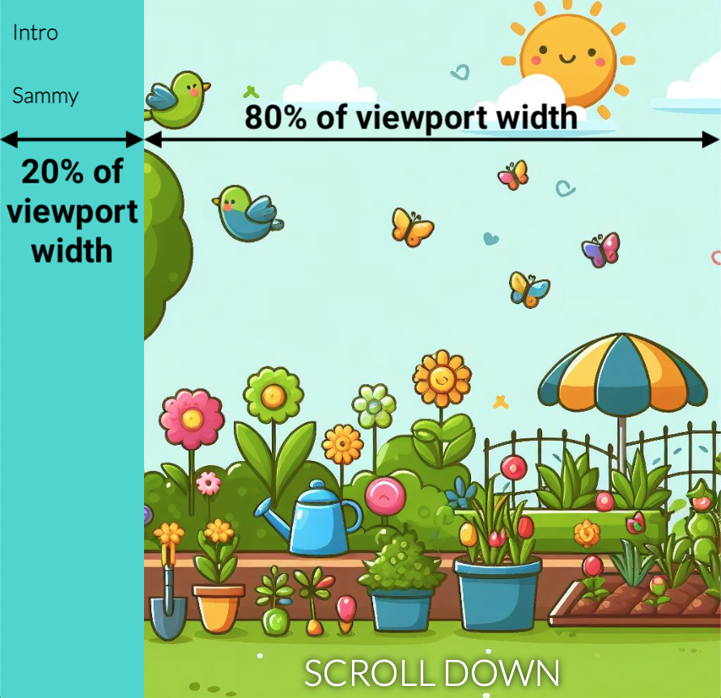

## Add a new page

In this step, you will add a new webpage and navigation bar (navbar) to your website.

<iframe src="https://editor.raspberrypi.org/en/embed/viewer/animated-story-step4" width="100%" height="800" frameborder="0" marginwidth="0" marginheight="0" allowfullscreen> </iframe>

### Add a navbar

If you have completed the [Welcome to Antarctica](https://projects.raspberrypi.org/en/projects/welcome-to-antarctica) project, you will know how to create a navbar.

\--- task ---

Open the `index.html` file.

Find the `<body>` tag.

Add the `<nav>` tags below it with the links to be shown in the navbar.

## --- code ---

language: html
filename: index.html
line_numbers: true
line_number_start: 11
line_highlights: 12-15
-----------------------------------------------------------

  <body>
    <nav class="navigation">
      <a href="index.html">Intro</a>
      <a href="sammy.html">Sammy</a>
    </nav>
    <main>

\--- /code ---

**Click Run**

- The navigation links will appear at the top.

\--- /task ---

\--- collapse ---

---

## title: The navigation links are not there

- Make sure you add the `class="navigation"` attribute to the opening `<nav>`.

\--- /collapse ---

### Create a new webpage

\--- task ---

**Click** the **+ Add file** button.

Name your new file `sammy.html` and click the **Add file** button.

\--- /task ---

To get you started with this new page, you will use HTML that is similar to the content of `index`.

\--- task ---

Add this content to your new `sammy.html` file.

## --- code ---

language: html
filename: sammy.html
line_numbers: true
line_number_start: 1
------------------------------------------------------------------------------

<!DOCTYPE html>

<html lang="en">
  <head>
    <meta charset="UTF-8" />
    <meta name="viewport" content="width=device-width, initial-scale=1.0" />
    <title>Sammy</title>
    <link rel="stylesheet" href="style.css" />
    <link rel="stylesheet" href="default.css" />
  </head>

  <body>
    <nav class="navigation">
      <a href="index.html">Intro</a>
      <a href="sammy.html">Sammy</a>
    </nav>
    <main>
      <section class="garden">
        
SCROLL DOWN

      </section>
    </main>
  </body>
  
</html>

\--- /code ---

\--- /task ---

### Position the navbar on the left

To make this website feel more like a book, you can place the navbar on the left.

\--- task ---

Open the `style.css` file and find the `.navigation` selector.

Add the `position` and `width` properties to the `.navigation` selector.

## --- code ---

language: css
filename: style.css
line_numbers: true
line_number_start: 82
line_highlights: 92-93
-----------------------------------------------------------

/\* NAV BAR \*/

.navigation {
background-color: var(--navigation-background-color);
top: 0;
display: flex;
flex-direction: column;
height: 100%;
font-size: 3cqw;
font-weight: 900;
position: fixed;
width: 20vw;
}

\--- /code ---

**Click Run**

- The navbar should be positioned on the left.

\--- /task ---

The 'SCROLL DOWN' text is not centered any more because the navbar is styled with `width: 20vw`, so takes up 20% of the width of the viewport.

\--- task ---

Add a `padding-left` property to the styling of `main`.

## --- code ---

language: css
filename: style.css
line_numbers: true
line_number_start: 14
line_highlights: 15
--------------------------------------------------------

main {
padding-left: 20vw;
}

\--- /code ---

\--- /task ---

You can change the width of an element so it stretches over a **percentage** of the viewport width.

\--- task ---

Change the width property of the `#bounce` selector to `80vw` (80% of the viewport width).

## --- code ---

language: css
filename: style.css
line_numbers: true
line_number_start: 40
line_highlights: 41
--------------------------------------------------------

\#bounce {
width: 80vw;
position: fixed;
bottom: 0;
text-align: center;
color: var(--text-color);
font-size: 5cqw;
text-shadow: 0 0 10px var(--text-shadow-color);
animation: bounce 1s infinite;
}

\--- /code ---

**Click Run**

- The 'SCROLL DOWN' text should be positioned centrally.

\--- /task ---

### Size the font with a container query

The font size is currently set to a **fixed** size of 50 pixels (`50px`).

You can use `cqh` instead of `px` to calculate the size of the font, so it always relates to the height of its container element.

\--- task ---

Change the `font-size` property of the `p` selector to `3cqh`.

## --- code ---

language: css
filename: style.css
line_numbers: true
line_number_start: 69
line_highlights: 70
--------------------------------------------------------

p {
font-size: 3cqh;
padding-left: 5vw;
padding-right: 5vw;
}

\--- /code ---

**Click Run**

- Resize the **height** of the editor preview to see your font size change!

\--- /task ---

\--- collapse ---

---

## title: What is cqh?

Container query height (cqh) are units that specify a size relative to the dimensions of an element's container element.

`1cqh` is 1% of the container's height. For example, if the container's height is 300px, then a value of `10cqh` on a property will be 30px.

One benefit of using `cqh` units rather than `px` (pixel units) for sizing elements is that elements will resize along with their container. This usually happens when you resize a browser window, or view a webpage on a different screen.

Here is an example:

In the example, the font size of the the main story text has been set to use `cqh`, so it changes with the browser's height.

The font size of the text in the navbar has been set to use `cqw`, so it changes with the browser's width.

\--- /collapse ---

Your website is looking awesome!

Next, you will add a cool animation to the text to grab people's attention!
