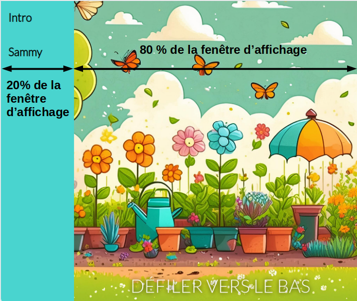

## Ajouter une nouvelle page

Dans cette étape, tu vas ajouter une nouvelle page web et une nouvelle barre de navigation (navbar) à ton site web.

<iframe src="https://editor.raspberrypi.org/fr-FR/embed/viewer/animated-story-step4" width="100%" height="800" frameborder="0" marginwidth="0" marginheight="0" allowfullscreen> </iframe>

### Ajouter une barre de navigation

Si tu as terminé le projet [Bienvenue en Antarctique](https://projects.raspberrypi.org/fr-FR/projects/welcome-to-antarctica), tu sauras comment créer une barre de navigation.

--- task ---

Ouvre le fichier `index.html`.

Trouve la balise `<body>`.

Ajoute les balises `<nav>` au-dessous avec les liens à afficher dans la barre de navigation.

--- code ---
---
language: html
filename: index.html
line_numbers: true
line_number_start: 11
line_highlights: 12-15
---

  <body>
    <nav class="navigation">
      <a href="index.html">Intro</a>
      <a href="sammy.html">Sammy</a>
    </nav>
    <main>

--- /code ---

**Clique sur Run**

- Les liens de navigation apparaîtront en haut.

--- /task ---

--- collapse ---

---
title: Les liens de navigation ne sont pas là
---

- Assure-toi d'ajouter l'attribut `class="navigation"` à la balise d'ouverture `<nav>`.

--- /collapse ---

### Créer une nouvelle page web

--- task ---

**Clique** sur le bouton **+ Add file**.

Nomme ton nouveau fichier `sammy.html` et clique sur le bouton **Add file**.

--- /task ---

Pour commencer avec cette nouvelle page, tu utiliseras du HTML similaire au contenu de `index`.

--- task ---

Ajoute ce contenu à ton nouveau fichier `sammy.html`.

--- code ---
---
language: html
filename: sammy.html
line_numbers: true
line_number_start: 1
---

<!DOCTYPE html>
<html lang="en">
  <head>
    <meta charset="UTF-8" />
    <meta name="viewport" content="width=device-width, initial-scale=1.0" />
    <title>Sammy</title>
    <link rel="stylesheet" href="style.css" />
    <link rel="stylesheet" href="default.css" />
  </head>

  <body>
    <nav class="navigation">
      <a href="index.html">Intro</a>
      <a href="sammy.html">Sammy</a>
    </nav>
    <main>
      <section class="garden">
        
DÉFILER VERS LE BAS

      </section>
    </main>
  </body>
  
</html>

--- /code ---

--- /task ---

### Positionner la barre de navigation à gauche

Pour que ce site web ressemble davantage à un livre, tu peux placer la barre de navigation sur la gauche.

--- task ---

Ouvre le fichier `style.css` et recherche le sélecteur `.navigation`.

Ajoute les propriétés `position` et `width` au sélecteur `.navigation`.

--- code ---
---
language: css
filename: style.css
line_numbers: true
line_number_start: 82
line_highlights: 92-93
---

/* BARRE DE NAVIGATION */

.navigation {
  background-color: var(--navigation-background-color);
  top: 0;
  display: flex;
  flex-direction: column;
  height: 100%;
  font-size: 3cqw;
  font-weight: 900;
  position: fixed;
  width: 20vw;
}

--- /code ---

**Clique sur Run**

- La barre de navigation doit être positionnée sur la gauche.

--- /task ---

Le texte « DÉFILER VERS LE BAS » n'est plus centré car la barre de navigation est stylisée avec `width: 20vw`, ce qui représente 20 % de la largeur de la fenêtre d'affichage.

--- task ---

Ajoute une propriété `padding-left` au style `main`.

--- code ---
---
language: css
filename: style.css
line_numbers: true
line_number_start: 14
line_highlights: 15
---

main {
  padding-left: 20vw;
}

--- /code ---

--- /task ---

Tu peux modifier la largeur d'un élément pour qu'il s'étende sur un **pourcentage** de la largeur de la fenêtre.

--- task ---

Modifie la propriété width du sélecteur `#bounce` en `80vw` (80 % de la largeur de la fenêtre).

--- code ---
---
language: css
filename: style.css
line_numbers: true
line_number_start: 40
line_highlights: 41
---

#bounce {
  width: 80vw;
  position: fixed;
  bottom: 0;
  text-align: center;
  color: var(--text-color);
  font-size: 5cqw;
  text-shadow: 0 0 10px var(--text-shadow-color);
  animation: bounce 1s infinite;
}

--- /code ---

**Clique sur Run**

- Le texte « DÉFILER VERS LE BAS » doit être positionné au centre.

--- /task ---

### Dimensionner la police avec une requête de conteneur

La taille de la police est actuellement définie à une taille **fixe** de 50 pixels (`50px`).

Tu peux utiliser `cqh` au lieu de `px` pour calculer la taille de la police, de sorte qu'elle soit toujours liée à la hauteur de son élément conteneur.

--- task ---

Modifie la propriété `font-size` du sélecteur `p` en `3cqh`.

--- code ---
---
language: css
filename: style.css
line_numbers: true
line_number_start: 69
line_highlights: 70
---

p {
  font-size: 3cqh;
  padding-left: 5vw;
  padding-right: 5vw;
}

--- /code ---

**Clique sur Run**

- Redimensionne la **hauteur** de l'aperçu de l'éditeur pour voir le changement de taille de la police !

--- /task ---

--- collapse ---

---
title: Qu'est-ce que cqh ?
---

Le Container query height (cqh) est une unité qui spécifie une taille relative aux dimensions de l'élément conteneur d'un élément.

`1cqh` représente 1 % de la hauteur du conteneur. Par exemple, si la hauteur du conteneur est de 300px, alors une valeur de `10cqh` sur une propriété sera de 30px.

L’un des avantages de l’utilisation des unités `cqh` plutôt que `px` (unités de pixels) pour dimensionner les éléments est que les éléments seront redimensionnés avec leur conteneur. Cela se produit généralement lorsque tu redimensionnes une fenêtre de navigateur ou affiches une page web sur un autre écran.

Voici un exemple :

Dans l'exemple, la taille de la police du texte de l'histoire principale a été définie pour utiliser `cqh`, elle change donc avec la hauteur du navigateur.

La taille de la police du texte dans la barre de navigation a été définie pour utiliser `cqw`, elle change donc avec la largeur du navigateur.

--- /collapse ---

Ton site web est génial !

Ensuite, tu ajouteras une animation cool au texte pour attirer l'attention des gens !
