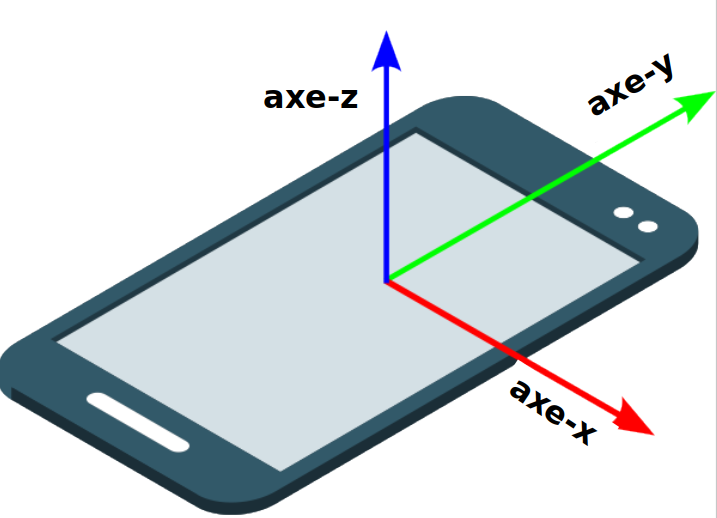

## Animer l'histoire

Dans cette étape, tu vas animer le titre et une image.

<iframe src="https://editor.raspberrypi.org/fr-FR/embed/viewer/animated-story-complete?page=sammy.html" width="100%" height="800" frameborder="0" marginwidth="0" marginheight="0" allowfullscreen> </iframe>

### Créer un déclencheur

Un élément `
` vide peut être utilisé pour déclencher une animation.

--- task ---

Ouvre le fichier `sammy.html`.

Ajoute un élément `
` au-dessus de l'élément `<h1>` et donne-lui l'attribut `id="headingTrigger"`.

--- code ---
---
language: html
filename: sammy.html
line_numbers: true
line_number_start: 19
line_highlights: 20
---

  </section>
  

  <h1 id="hideBounce">Sammy  L'escargot</h1>

--- /code ---

--- /task ---

### Activer/désactiver l'animation

Un Intersection Observer peut être utilisé pour surveiller l'`id` que tu viens d'ajouter au `
` vide.

Si le `
` **quitte** la fenêtre d'affichage, le rappel ajoute la classe `enabled` à l'élément `<h1>`.

Le sélecteur `.enabled` définit les couleurs de la police du titre et de l'arrière-plan. Il définit également une propriété `position: sticky`, donc le titre reste dans son emplacement actuel (en haut) lorsque la classe `enabled` est ajoutée.

La méthode toggle est utilisée pour activer ou désactiver l'effet lorsque l'élément cible (le `
` vide) quitte et entre dans la fenêtre d'affichage.

--- task ---

Ouvre le fichier `sammy.js`.

Crée un Intersection Observer appelé `headingObserver`.

--- code ---
---
language: js
filename: sammy.js
line_numbers: true
line_number_start: 9
line_highlights:
---

// Observateur de titre
const headingObserver = new IntersectionObserver((entries) => {
  document.querySelector("h1").classList.toggle("enabled", !entries[0].isIntersecting);
});
headingObserver.observe(document.querySelector("#headingTrigger"));

--- /code ---

**Clique sur Run**

- Fais défiler vers le bas pour voir le titre coller et changer de couleur lorsqu'il atteint le haut.

--- collapse ---

---
title: Le titre ne colle pas quand il atteint le haut
---

- Assure-toi d'avoir `!` avant `entries[0].isIntersecting`.

--- /collapse ---

--- collapse ---

---
title : Pourquoi le texte passe-t-il derrière le titre ?
---

En CSS, `z-index` est une propriété qui contrôle l'ordre des calques des éléments sur l'axe z (l'axe qui sort de l'écran vers l'utilisateur).

Tu peux utiliser la propriété `z-index` pour faire apparaître les éléments les uns devant ou derrière les autres.

Trouve le sélecteur `h1` dans le fichier `style.css`.

--- code ---
---
language: css
filename: style.css
line_numbers: true
line_number_start: 18
line_highlights: 27
---

h1 {
  margin: 0;
  color: var(--main-color);
  background-color: var(--background-color);
  top: 0;
  left: 1rem;
  padding-left: 2rem;
  line-height: 2;
  margin-top: 1px;
  z-index: 1;
  transition: all 300ms;
}

--- /code ---

Le sélecteur stylise le titre de sorte que son z-index est `1`, ce qui signifie que son z-index est plus élevé que les autres éléments (qui sont définis à `0` par défaut). Cela signifie que le titre apparaît devant les autres éléments, sur la couche supérieure.

**Test :**

- Définis la propriété `z-index` du sélecteur `h1` à `-1`.

**Clique sur Run**

- Fais défiler vers le bas pour voir le texte de l’histoire apparaître devant le titre.
- Remets z-index à `1` lorsque tu as terminé le test.

--- /collapse ---

--- /task ---

--- collapse ---

---
title: Utiliser l'opérateur logique NOT
---

L'opérateur logique NOT `!` est utilisé avec la méthode `isIntersecting` dans le rappel, donc la classe `enabled` n'est ajoutée que lorsque `
` n'est **pas** dans la fenêtre d'affichage.

--- /collapse ---

### Ajouter une image pour le personnage

Cette page concerne l'un des personnages de l'histoire : Sammy L'escargot.

Tu peux ajouter une image de Sammy à la page.

Tu as d'abord besoin d'un arrière-plan pour Sammy.

--- task ---

Ouvre le fichier `sammy.html`.

Ajoute un nouvel élément `<section>` avec l'attribut `class="garden"`.

--- code ---
---
language: html
filename: sammy.html
line_numbers: true
line_number_start: 24
line_highlights: 25-27
---

      

      <section class="garden">
        
      </section>

--- /code ---

--- /task ---

Ajoute l'image de l'escargot.

--- task ---

Ajoute un élément `` avec les attributs `id="snail"`, `class="snail"`, et un texte alt pour améliorer l'accessibilité.

--- code ---
---
language: html
filename: sammy.html
line_numbers: true
line_number_start: 26
line_highlights: 28
---

      

      <section class="garden">
        
      </section>
    </main>

--- /code ---

--- /task ---

--- collapse ---

---

## title: Pourquoi 'src' et 'data-src' sont tous les deux définis sur 'snail.svg' ?

Les valeurs de l'attribut `src` et `data-src` sont les mêmes, parce que `imageObserver` agira sur cet élément ``, mais nous ne voulons pas que l'image change.

--- /collapse ---

### Styliser l'image du personnage

L'image de Sammy apparaîtra sur la gauche et se déplacera au milieu. Il va également « disparaître ».

--- task ---

Ouvre le fichier `style.css`.

Trouve le commentaire `/* ESCARGOT */`.

Ajoute le sélecteur `.snail`.

--- code ---
---
language: css
filename: style.css
line_numbers: true
line_number_start: 95
line_highlights: 97-106
----

/* ESCARGOT */

.snail {
  opacity: 0;
  transform: translateX(-20%);
  transition: all 2s ease-out;
  height: 20vh;
  margin-top: 80vh;
  position: relative;
  padding-left: 0;
}

/* BARRE DE NAVIGATION */

--- /code ---

--- collapse ---

---
title: Comment l'image est-elle stylisée ?
---

Le sélecteur `.snail` stylise l'image avec `0` opacité, la rendant invisible. Il déplace également l'image à gauche à 25 % de la largeur de son élément parent.

Sa hauteur est de 20 % de la hauteur de la fenêtre d'affichage (`20vh`). Cela signifie qu'il se redimensionnera en fonction de la hauteur de la fenêtre du navigateur.

--- /collapse ---

--- /task ---

### Afficher et déplacer l'image du personnage

Pour animer l'image, tu changeras son opacité à 1, la rendant pleinement visible. Elle se déplacera également à droite de 25 % de sa propre largeur.

--- task ---

Ajoute le sélecteur `.startCrawl`.

--- code ---
---
language: css
filename: style.css
line_numbers: true
line_number_start: 95
line_highlights: 107-111
---

/* ESCARGOT */

.snail {
  opacity: 0;
  transform: translateX(-20%);
  transition: all 2s ease-out;
  height: 20vh;
  margin-top: 80vh;
  position: relative;
  padding-left: 0;
}

.startCrawl {
  opacity: 1;
  transform: translateX(25%);
}

/* BARRE DE NAVIGATION */

--- /code ---

--- /task ---

### Déclencher l'animation startCrawl

Cet Intersection Observer surveillera un élément avec l'attribut `id="snail"`.

Si l'élément entre dans la fenêtre d'affichage (`isIntersecting`), le rappel ajoute la classe `startCrawl` à l'élément.

--- task ---

Ouvre le fichier `sammy.js`.

Crée un Intersection Observer appelé `snailObserver`.

--- code ---
---
language: js
filename: sammy.js
line_numbers: true
line_number_start: 15
line_highlights:
---

// Observateur d'escargot
const snailObserver = new IntersectionObserver((entries) => {
  if (entries[0].isIntersecting) {
    entries[0].target.classList.add("startCrawl");
  }
});
snailObserver.observe(document.querySelector("#snail"));

--- /code ---

**Clique sur Run**

- Fais défiler vers le bas pour voir l'animation de l'escargot lorsqu'il entre dans la fenêtre d'affichage.

--- /task ---

### Définir un seuil

Des options peuvent être ajoutées à l'observateur, de sorte qu'il ne se déclenche que lorsqu'un pourcentage de l'élément se croise.

--- task ---

Ajoute une option à l'observateur, afin qu'il ne déclenche le rappel que lorsque toute l'image de l'escargot est dans la fenêtre d'affichage.

--- code ---
---
language: js
filename: sammy.js
line_numbers: true
line_number_start: 15
line_highlights: 20-22
---

// Observateur d'escargot
const snailObserver = new IntersectionObserver((entries) => {
  if (entries[0].isIntersecting) {
    entries[0].target.classList.add("startCrawl");
  }
},
{ threshold: 1 }
);
snailObserver.observe(document.querySelector("#snail"));

--- /code ---

--- collapse ---

---
title: Quelles sont les options "threshold" (seuil) ?
---

Les valeurs de seuil varient de `0` à `1`

- `1` signifie que chaque pixel de l'élément doit être dans la fenêtre d'affichage pour que le rappel s'exécute
- `0` est la valeur par défaut et signifie qu'un seul pixel doit se croiser pour que le rappel s'exécute

--- /collapse ---

**Clique sur Run**

- Fais défiler vers le bas pour voir que l'animation ne démarre que lorsque l'image entière est dans la fenêtre d'affichage.

--- /task ---
