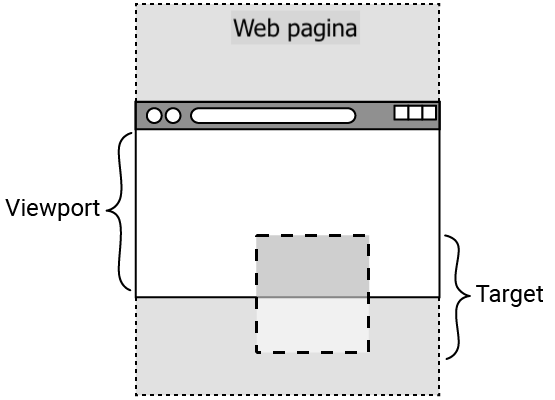

## Elementen observeren

In deze stap ga je de 'intersection observer' gebruiken om wat tekst te laten verdwijnen!

<iframe src="https://editor.raspberrypi.org/en/embed/viewer/animated-story-step2" width="100%" height="800" frameborder="0" marginwidth="0" marginheight="0" allowfullscreen> </iframe>

\--- task ---

Open het [Geanimeerd verhaal starter project](https://editor.raspberrypi.org/en/projects/animated-story-starter){:target="_blank"}.

\--- /task ---

Je startproject bevat:

- `index.html`: een HTML-pagina met afbeeldingen en tekst
- `style.html` en `default.css`: CSS-bestanden die styling bevatten voor een deel van de inhoud
- De afbeeldingen die je in het project gaat gebruiken
- `scripts.js`: een JavaScript-bestand dat je tijdens het project zult ontwikkelen

### Console

\--- task ---

Open de console.

**Tip:** De meeste browsers bieden je de mogelijkheid om met de rechtermuisknop op een pagina te klikken en een element te 'Inspecteren'.

Hiermee worden ontwikkelaarstools geopend, inclusief de Console.

Enkele handige sneltoetsen:

- Chrome: Ctrl + Shift + J (op Windows) of Cmd + Option + J (op een Mac)
- Firefox: Ctrl + Shift + J (op Windows) of Cmd + Option + K (op een Mac)
- Microsoft Edge: Ctrl + Shift + I
- Safari: Schakel eerst het menu 'Ontwikkelen' in. Om dit te doen, klik je op **Safari** in het menu van Mac en selecteer **Instellingen**. Klik op **Geavanceerd**, vink het selectievakje aan naast 'Toon functies voor webontwikkelaars' en sluit vervolgens het venster. Je kunt de console nu openen met Cmd + Optie + C.

\--- /task ---

Met een JavaScript-observer kun je een verzameling HTML-elementen met een specifiek `id`- of `class`-kenmerk bekijken ('observeren').

Een verzameling items wordt een **array** genoemd. Een array kan meerdere items of slechts één item bevatten.

Een observer kan bijvoorbeeld worden gebruikt om de browser te laten detecteren wanneer een element de viewport binnenkomt.

De **viewport** is het gebied van de webpagina dat momenteel zichtbaar is in de browser.

Je kunt iets uitvoeren naar de console om te zien of je observer werkt.

### Maak een intersection observer met de naam bounceObserver

\--- task ---

Open het `scripts.js` bestand.

Maak een observer met de naam `bounceObserver`.

## --- code ---

language: js
filename: scripts.js
line_numbers: true
line_number_start: 1
line_highlights: 2-4
---------------------------------------------------------

// Verberg bounce observer
const bounceObserver = new IntersectionObserver(

);

// Afbeeldingswaarnemer

\--- /code ---

**Tip:** Scheid de verschillende waarnemers door middel van een regelafbreking (in dit geval, op regel 5).

\--- /task ---

### Vertel bounceObserver om te observeren

\--- task ---

Roep `bounceObserver` aan om het element in het `document` (webpagina) met het kenmerk `id="hideBounce"` te `observeren`.

**Opmerking:** Dit element wordt het 'target'-element genoemd.

Geobserveerde elementen worden doorgegeven aan het `entries`-array in de observer.

## --- code ---

language: js
filename: scripts.js
line_numbers: true
line_number_start: 1
line_highlights: 2, 5
----------------------------------------------------------

// Verberg bounce observer
const bounceObserver = new IntersectionObserver((entries)

);
bounceObserver.observe(document.querySelector("#hideBounce"));

// Afbeeldingswaarnemer

\--- /code ---

**Let op:** De regelafbreking op regel 3 bevat de callback.

 De **callback** is de code die wordt uitgevoerd wanneer de browser een doelelement detecteert ('observeert').

\--- /task ---

### De callback maken

\--- task ---

Pijl-syntaxis (`=>`) kan worden gebruikt in plaats van het trefwoord `function`.

## --- code ---

language: js
filename: scripts.js
line_numbers: true
line_number_start: 1
line_highlights: 2, 4
----------------------------------------------------------

// Verberg bounce observer
const bounceObserver = new IntersectionObserver((entries) => {

});
bounceObserver.observe(document.querySelector("#hideBounce"));

// Afbeeldingswaarnemer

\--- /code ---

\--- /task ---

De callback zal beginnen met het checken van `if (of)` het element in de `entries` array (met het kenmerk `id="hideBounce"`) (het target element de viewport is binnengekomen.

Om dit te controleren wordt de `isIntersecting`-methode gebruikt.

Deze afbeelding toont een targetelement op een webpagina dat in de viewport van de browser is binnengekomen.

\--- task ---

Start de callback met een voorwaardelijke instructie.

## --- code ---

language: js
filename: scripts.js
line_numbers: true
line_number_start: 1
line_highlights: 3-5
---------------------------------------------------------

// Verberg bounce observer
const bounceObserver = new IntersectionObserver((entries) => {
if (entries[0].isIntersecting) {

}
});
bounceObserver.observe(document.querySelector("#hideBounce"));

// Afbeeldingswaarnemer

\--- /code ---

**Tip:** Er is slechts één element in de entries-array (op index 0). Daarom kun je er rechtstreeks toegang toe krijgen met behulp van `entries[0]`.

\--- /task ---

### Een bericht naar de console sturen

Als aan de voorwaarde is voldaan (het element met het kenmerk `id="hideBounce"` is in de viewport terechtgekomen), kun je met behulp van `console.log()` een bericht naar de console sturen om te testen.

\--- task ---

Voeg een actie toe die een testbericht naar de console stuurt wanneer aan de `if`-voorwaarde wordt voldaan.

## --- code ---

language: js
filename: scripts.js
line_numbers: true
line_number_start: 1
line_highlights: 4
-------------------------------------------------------

// Verberg bounce observer
const bounceObserver = new IntersectionObserver((entries) => {
if (entries[0]. sIntersecting) {
console.log("BOUNCE TRIGGER IN VIEWPORT");
}
});
bounceObserver.observe(document.querySelector("#hideBounce"));

// Afbeeldingswaarnemer

\--- /code ---

**Klik op Run**

- Open de console.
- Scroll naar beneden en zie het bericht "BOUNCE TRIGGER IN VIEWPORT" verschijnen in de console.

\--- /task ---

\--- collapse ---

---

## title: Er verschijnt niets in de console

- Controleer de spelling van `IntersectionObserver`. Er moeten twee hoofdletters in staan.
- Er moet een puntkomma aan het einde van regel 4, 6 en 7 staan.
- Sluit alle haakjes en accolades.

\--- /collapse ---

\--- collapse ---

---

## title: De structuur van de bounceObserver intersection observer

Op regel 2 is `entries` een verzameling van alle elementen op de webpagina met het kenmerk `id="hideBounce"`.

Een verzameling items wordt een 'array' genoemd.

De `bounceObserver` is ingesteld om te observeren wanneer het eerste (in dit geval het enige) targetelement in de `entries`-array de viewport binnenkomt.

Wanneer dit het geval is, stuurt de observer 'callback' een bericht naar de console.

\--- /collapse ---

### Verberg Tekst

Onderaan de indexpagina staat een stuiterende tekst die aangeeft om de actie 'OMLAAG SCROLLEN' uit te voeren.

\--- task ---

**Test:** Scroll naar beneden.

Je zult zien dat de tekst 'OMLAAG SCROLLEN' over de andere inhoud heen staat.

\--- /task ---

Je kunt meer doen dan alleen berichten naar de console sturen.

Je kunt de stuiterende 'OMLAAG SCROLLEN'-tekst verbergen door de waarde van de eigenschap 'opacity' te wijzigen.

\--- task ---

Voeg een actie toe wanneer aan de `if`-voorwaarde wordt voldaan. Deze actie wijzigt de waarde van de `opacity`-eigenschap van het stuiterende tekstelement, dat het kenmerk `id="bounce"` heeft.

Zet de opacity waarde op `0` om deze onzichtbaar te maken.

## --- code ---

language: js
filename: scripts.js
line_numbers: true
line_number_start: 1
line_highlights: 5
-------------------------------------------------------

// Verberg bounce-observator
const bounceObserver = new IntersectionObserver((entries) => {
if (entries[0].isIntersecting) {
console.log("BOUNCE TRIGGER IN VIEWPORT");
document.querySelector("#bounce").style.opacity = 0;
}
});
bounceObserver.observe(document.querySelector("#hideBounce"));

// Afbeeldingswaarnemer

\--- /code ---

\--- /task ---

\--- task ---

**Klik op Run**

- Scroll naar beneden om de stuiterende tekst 'OMLAAG SCROLLEN' te zien verdwijnen!

\--- /task ---

\--- collapse ---

---

## title: De stuiterende tekst verdwijnt niet

- Er moet een puntkomma staan aan het eind van regel 5.
- Zorg ervoor dat je `querySelector` correct spelt, inclusief de hoofdletter!

\--- /collapse ---

## Sla je project op

Je project wordt automatisch opgeslagen. Ga terug naar de startlink in dezelfde webbrowser om je wijzigingen te zien.

Vervolgens ga je de browserprestaties verbeteren door afbeeldingen alleen te laden wanneer ze nodig zijn.
