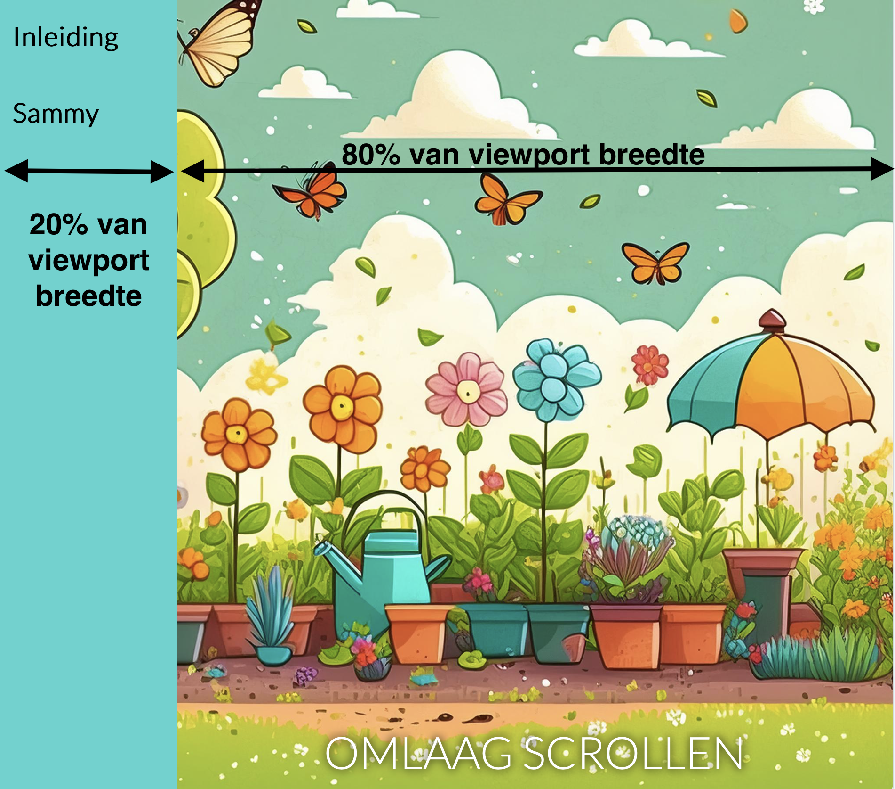
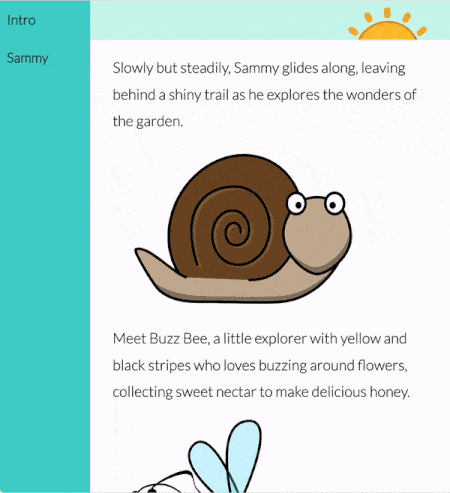

## Nieuwe pagina toevoegen

In deze stap voeg je een nieuwe webpagina en navigatiebalk (navbar) toe aan je website.

<iframe src="https://editor.raspberrypi.org/en/embed/viewer/animated-story-step4" width="100%" height="800" frameborder="0" marginwidth="0" marginheight="0" allowfullscreen> </iframe>

### Voeg een navigatiebalk toe

Als je het project [Welkom op Antarctica](https://projects.raspberrypi.org/en/projects/welcome-to-antarctica) hebt voltooid, weet je hoe je een navigatiebalk maakt.

\--- task ---

Open het `index.html` bestand.

Zoek de `<body>` tag.

Voeg daaronder de tags `<nav>` toe met de links die in de navigatiebalk moeten worden weergegeven.

## --- code ---

language: html
filename: index.html
line_numbers: true
line_number_start: 11
line_highlights: 12-15
-----------------------------------------------------------

  <body>
    <nav class="navigation">
<a href="index.html">Inleiding</a>
      <a href="sammy.html">Sammy</a>    </nav>
    <main>

\--- /code ---

**Klik op Run**

- De navigatielinks verschijnen bovenaan.

\--- /task ---

\--- collapse ---

---

## title: De navigatielinks zijn er niet

- Zorg ervoor dat je het `class="navigation"` attribuut toevoegt aan de opening `<nav>`.

\--- /collapse ---

### Maak een nieuwe webpagina

\--- task ---

**Klik** op de knop **+ Add file**.

Geef jouw nieuwe bestand de naam `sammy.html` en klik op de knop **Add file**.

\--- /task ---

Om je op weg te helpen met deze nieuwe pagina, gebruik je HTML die vergelijkbaar is met de inhoud van `index`.

\--- task ---

Voeg deze inhoud toe aan je nieuwe `sammy.html` bestand.

## --- code ---

language: html
filename: sammy.html
line_numbers: true
line_number_start: 1
------------------------------------------------------------------------------

<!DOCTYPE html>

<html lang="en">
  <head>
    <meta charset="UTF-8" />
    <meta name="viewport" content="width=device-width, initial-scale=1.0" />
    <title>Sammy</title>
    <link rel="stylesheet" href="style.css" />
    <link rel="stylesheet" href="default.css" />
  </head>

  <body>
    <nav class="navigation">
<a href="index.html">Inleiding</a>
      <a href="sammy.html">Sammy</a>    </nav>
    <main>
      <section class="garden">
        
OMLAAG SCROLLEN

      </section>
    </main>
  </body>
  
</html>

\--- /code ---

\--- /task ---

### Plaats de navigatiebalk aan de linkerkant

Om deze website meer op een boek te laten lijken, kun je de navigatiebalk aan de linkerkant plaatsen.

\--- task ---

Open het bestand `style.css` en zoek de `.navigation`-selector.

Voeg de eigenschappen `position` en `width` toe aan de `.navigation` selector.

## --- code ---

language: css
filename: style.css
line_numbers: true
line_number_start: 82
line_highlights: 92-93
-----------------------------------------------------------

/\* NAV-BALK \*/

.navigation {
background-color: var(--navigation-background-color);
top: 0;
display: flex;
flex-direction: column;
height: 100%;
font-size: 3cqw;
font-weight: 900;
position: fixed;
width: 20vw;
}

\--- /code ---

**Klik op Run**

- De navigatiebalk moet aan de linkerkant worden geplaatst.

\--- /task ---

De tekst 'OMLAAG SCROLLEN' is niet meer gecentreerd omdat de navigatiebalk is opgemaakt met 'width: 20vw' en dus 20% van de breedte van het venster in beslag neemt.

\--- task ---

Voeg de eigenschap `padding-left` toe aan de styling van `main`.

## --- code ---

language: css
filename: style.css
line_numbers: true
line_number_start: 14
line_highlights: 15
--------------------------------------------------------

main {
padding-left: 20vw;
}

\--- /code ---

\--- /task ---

Je kunt de breedte van een element veranderen zodat het wordt uitgelijnd over een **percentage** van de breedte van het viewport.

\--- task ---

Verander de breedte eigenschap van de `#bounce` selector in `80vw` (80% van de viewport width).

## --- code ---

language: css
filename: style.css
line_numbers: true
line_number_start: 40
line_highlights: 41
--------------------------------------------------------

\#bounce {
width: 80vw;
position: fixed;
bottom: 0;
text-align: center;
color: var(--text-color);
font-size: 5cqw;
text-shadow: 0 0 10px var(--text-shadow-color);
animation: bounce 1s infinite;
}

\--- /code ---

**Klik op Run**

- De 'OMLAAG SCROLLEN' tekst moet worden gecentreerd.

\--- /task ---

### De grootte van het lettertype aanpassen met een containerquery

De lettergrootte is momenteel ingesteld op een **vaste** grootte van 50 pixels (`50px`).

Je kunt `cqh` in plaats van `px` gebruiken om de grootte van het lettertype te berekenen, zodat het altijd gerelateerd is aan de hoogte van het containerelement.

\--- task ---

Verander de `font-size` eigenschap van de `p` selector naar `3cqh`.

## --- code ---

language: css
filename: style.css
line_numbers: true
line_number_start: 69
line_highlights: 70
--------------------------------------------------------

p {
font-size: 3cqh;
padding-left: 5vw;
padding-right: 5vw;
}

\--- /code ---

**Klik op Run**

- Pas de **hoogte** van de editor preview aan om je lettergrootte te zien veranderen!

\--- /task ---

\--- collapse ---

---

## title: Wat is cqh?

Container query hoogte (cqh) zijn eenheden die een grootte ten opzichte van de afmetingen van een element ten opzichte van zijn container element aangeven.

`1cqh` is 1% van de hoogte van de container. Bijvoorbeeld, als de hoogte van de container 300px is, dan zal een waarde `10cqh` op een eigenschap 30px zijn.

Een voordeel van het gebruiken van `cqh`-eenheden in plaats van `px` (pixeleenheden) voor het bepalen van de grootte van elementen, is dat de grootte van de elementen mee verandert met de grootte van hun container. Dit gebeurt meestal wanneer je het formaat van een browservenster wijzigt of een webpagina op een ander scherm bekijkt.

Hier is een voorbeeld:

In het voorbeeld is de lettergrootte van de hoofdtekst ingesteld op `cqh`, zodat deze verandert met de hoogte van de browser.

De lettergrootte van de tekst in de navigatiebalk is ingesteld op `cqw`, wat betekent dat deze verandert met de breedte van de browser.

\--- /collapse ---

Je website ziet er geweldig uit!

Vervolgens voeg je een leuke animatie toe aan de tekst om de aandacht van mensen te trekken!
