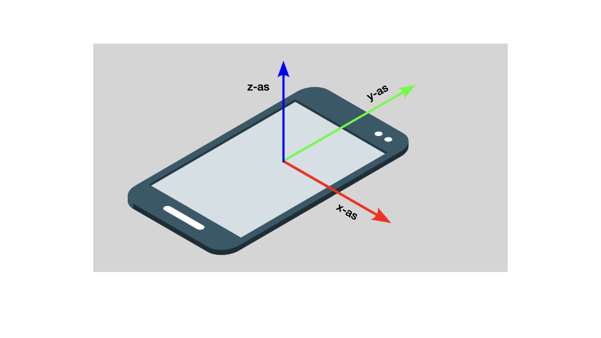

## Animeer het verhaal

In deze stap voeg je een animatie toe aan de kop en een afbeelding.

<iframe src="https://editor.raspberrypi.org/nl-NL/embed/viewer/animated-story-complete?page=sammy.html" width="100%" height="800" frameborder="0" marginwidth="0" marginheight="0" allowfullscreen> </iframe>

### Een trigger maken

Een leeg `
`-element kan worden gebruikt om een animatie te activeren.

--- task ---

Open het `sammy.html` bestand.

Voeg een `
` element toe boven het `<h1>` element en geef het het kenmerk `id="headingTrigger"`.

--- code ---
---
language: html
filename: sammy.html
line_numbers: true
line_number_start: 19
line_highlights: 20
---

      </section>
      

      <h1 id="hideBounce">Sammy  De Slak</h1>

--- /code ---

--- /task ---

### Animatie aan-/uitzetten

Met een intersection observer kun je de `id` in de gaten houden die je zojuist aan de lege `
` hebt toegevoegd.

Als `
` de viewport **verlaat**, voegt de callback de klasse `enabled` toe aan het element `<h1>`.

Met de selector `.enabled` bepaal je de kleuren voor het lettertype en de achtergrond van de koptekst. Het stelt ook de eigenschap `position: sticky` in, waardoor de koptekst op de huidige locatie (bovenaan) blijft staan wanneer de klasse `enabled` wordt toegevoegd.

Met de toggle-methode kun je het effect in- of uitschakelen wanneer het doelelement (de lege `
`) de viewport verlaat of binnenkomt.

--- task ---

Open het `sammy.js` bestand.

Maak een intersection observer met de naam `headingObserver`.

--- code ---
---
language: js
filename: sammy.js
line_numbers: true
line_number_start: 9
line_highlights:
---

// Kop waarnemer
const headingObserver = new IntersectionObserver((entries) => {
  document.querySelector("h1").classList.toggle("enabled", !entries[0].isIntersecting);
});
headingObserver.observe(document.querySelector("#headingTrigger"));

--- /code ---

**Klik op Run**

- Scroll naar beneden om de koptekst bovenaan te blijven zien staan en veranderen van kleur zodra deze bovenaan staat.

--- collapse ---

---
title: De kop blijft niet vaststaan wanneer deze de bovenkant bereikt
---
- Zorg ervoor dat er `!` voor `entries[0].isIntersecting` staat.

--- /collapse ---

--- collapse ---

---
title: Waarom staat de tekst achter de kop?
---

In CSS is `z-index` een eigenschap die de volgorde van elementen op de z-as (de as die van het scherm naar de kijker toe wijst) bepaalt.

Je kunt de `z-index` eigenschap gebruiken om elementen voor of achter elkaar te laten verschijnen.

Zoek de `h1`-selector in het `style.css`-bestand.

--- code ---
---
language: css
filename: style.css
line_numbers: true
line_number_start: 18
line_highlights: 27
---

h1 {
  margin: 0;
  color: var(--main-color);
  background-color: var(--background-color);
  top: 0;
  left: 1rem;
  padding-left: 2rem;
  line-height: 2;
  margin-top: 1px;
  z-index: 1;
  transition: all 300ms;
}

--- /code ---

De selector past de koptekst zo aan dat de z-index '1' is. Dit betekent dat de z-index hoger is dan die van de andere elementen (die standaard op '0' staan). Dit betekent dat de koptekst voor de andere elementen wordt weergegeven, op de bovenste laag.

**Test:**

- Stel de eigenschap `z-index` van de `h1`-selector in op `-1`.

**Klik op Run**

- Scroll naar beneden om de tekst van het verhaal voor de kop te zien verschijnen.
- Zet z-index terug naar `1` wanneer je klaar bent met testen.

--- /collapse ---

--- /task ---

--- collapse ---

---
title: Gebruik de logische NOT (niet) operator
---

De logische NOT `!`-operator wordt gebruikt met de `isIntersecting`-methode in de callback, zodat de `enabled`-klasse alleen wordt toegevoegd wanneer `
` **niet** in de viewport staat.

--- /collapse ---

### Voeg een afbeelding toe voor het personage

Deze pagina gaat over een van de personages uit het verhaal: Sammy de slak.

Je kunt een afbeelding van Sammy aan de pagina toevoegen.

Je hebt eerst een achtergrond nodig voor Sammy.

--- task ---

Open het `sammy.html` bestand.

Voeg een nieuw `<section>`-element toe met het kenmerk `class="garden"`.

--- code ---
---
language: html
filename: sammy.html
line_numbers: true
line_number_start: 24
line_highlights: 25-27
---

      

      <section class="garden">
        
      </section>

--- /code ---

--- /task ---

Voeg de afbeelding van de slak toe.

--- task ---

Voeg een `` element toe met de kenmerken `id="snail"`, `class="snail"`, en Alt tekst om de toegankelijkheid te verbeteren.

--- code ---
---
language: html
filename: sammy.html
line_numbers: true
line_number_start: 26
line_highlights: 28
---

      

      <section class="garden">
        
      </section>
    </main>

--- /code ---

--- /task ---

--- collapse ---

---
title: Waarom zijn 'src' en 'data-src' beide ingesteld op 'snail.svg'?
---

De waarden van de kenmerken `src` en `data-src` zijn hetzelfde, omdat `imageObserver` op dit ``-element zal reageren, maar we willen niet dat de afbeelding verandert.

--- /collapse ---

### Opmaken van de afbeelding van het personage

De afbeelding van Sammy zal van links verschijnen en naar het midden bewegen. Het zal ook 'vervagen'.

--- task ---

Open het `style.css` bestand.

Zoek het commentaar `/* SLAK */`.

Voeg de `.snail`-selector toe.

--- code ---
---
language: css
filename: style.css
line_numbers: true
line_number_start: 95
line_highlights: 97-106
---

/* SLAK */

.snail {
  opacity: 0;
  transform: translateX(-20%);
  transition: all 2s ease-out;
  height: 20vh;
  margin-top: 80vh;
  position: relative;
  padding-left: 0;
}

/* NAV-BALK */

--- /code ---

--- collapse ---

---
title: Hoe wordt de afbeelding opgemaakt?
---

De `.snail`-selector stijlt de afbeelding met `0` doorzichtigheid, waardoor deze onzichtbaar wordt. Het verplaatst ook de afbeelding naar 25% van de breedte van het bovenliggende element.

De hoogte is ingesteld op 20% van de hoogte van de viewport (`20vh`). Dit betekent dat het formaat wordt aangepast wanneer het browservenster van hoogte verandert.

--- /collapse ---

--- /task ---

### Toon en verplaats de afbeelding van het personage

Om de afbeelding te animeren verander je de ondoorzichtigheid naar 1, waardoor deze volledig zichtbaar is. Het zal ook 25% van zijn eigen breedte naar rechts bewegen.

--- task ---

Voeg het `.startCrawl` selector toe.

--- code ---
---
language: css
filename: style.css
line_numbers: true
line_number_start: 95
line_highlights: 107-111
---

/* SLAK */

.snail {
  opacity: 0;
  transform: translateX(-20%);
  transition: all 2s ease-out;
  height: 20vh;
  margin-top: 80vh;
  position: relative;
  padding-left: 0;
}

.startCrawl {
  opacity: 1;
  transform: translateX(25%);
}

/* NAV-BALK */

--- /code ---

--- /task ---

### Activeer de startCrawl-animatie

Deze intersection observer zal kijken naar een element met het kenmerk `id="snail"`.

Als het element de viewport binnenkomt (`isIntersecting`), voegt de callback de klasse `startCrawl` toe aan het element.

--- task ---

Open het `sammy.js` bestand.

Maak een intersection observer met de naam `snailObserver`.

--- code ---
---
language: js
filename: sammy.js
line_numbers: true
line_number_start: 15
line_highlights:
---

// Slakwaarnemer
const snailObserver = new IntersectionObserver((entries) => {
  if (entries[0].isIntersecting) {
    entries[0].target.classList.add("startCrawl");
  }
});
snailObserver.observe(document.querySelector("#snail"));

--- /code ---

**Klik op Run**

- Scroll naar beneden om de snail animatie te zien wanneer deze in de viewport verschijnt.

--- /task ---

### Stel een drempel in

Er kunnen opties aan de observer worden toegevoegd, zodat deze alleen wordt geactiveerd wanneer een bepaald percentage van het element in de viewport is.

--- task ---

Voeg een optie toe aan de waarnemer, zodat de callback alleen wordt geactiveerd wanneer de volledige slakafbeelding in de viewport staat.

--- code ---
---
language: js
filename: sammy.js
line_numbers: true
line_number_start: 15
line_highlights: 20-22
---

// Slak waarnemer
const snailObserver = new IntersectionObserver((entries) => {
  if (entries[0].isIntersecting) {
    entries[0].target.classList.add("startCrawl");
  }
},
{ threshold: 1 }
);
snailObserver.observe(document.querySelector("#snail"));

--- /code ---

--- collapse ---

---
title: Wat zijn de 'threshold' (drempel) opties?
---
Drempelwaarden variëren van `0` tot `1`
- `1` betekent dat elke afzonderlijke pixel van het element in de viewport moet staan om de callback te laten werken
- `0` is de standaardwaarde en betekent dat er slechts één pixel er in hoeft te staan om de callback te laten werken

--- /collapse ---

**Klik op Run**

- Scroll naar beneden om te zien dat de animatie pas begint als de hele afbeelding in de viewport staat.

--- /task ---
