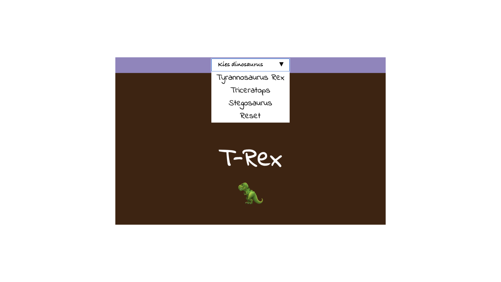

## Wat kun je verder nog doen?

Als je het [Meer web](https://projects.raspberrypi.org/nl-NL/pathways/more-web) pad volgt, kun je doorgaan naar het [Kies je favoriet](https://projects.raspberrypi.org/nl-NL/projects/pick-your-favourite) project. In dit project maak je een fan website waarmee een gebruiker keuzes kan maken die de inhoud van de webpagina veranderen! Je kunt een webpagina maken met content over verschillende sportteams, modemerken, tv-programma's of iets anders waar jij en je vrienden fan van zijn!

--- print-only ---

--- /print-only ---

--- no-print ---

<iframe src="https://editor.raspberrypi.org/nl-NL/embed/viewer/pick-your-favourite-dinosaur" width="100%" height="800" frameborder="0" marginwidth="0" marginheight="0" allowfullscreen> </iframe>

--- /no-print ---

Als je meer plezier wilt hebben met het verkennen van HTML, CSS en JavaScript, dan kun je een van [deze projecten](https://projects.raspberrypi.org/nl/projects?software%5B%5D=html-css-javascript) proberen.

***

Dit project werd vertaald door vrijwilligers:

Iny van Beuningen
Sanneke van der Meer

Dankzij vrijwilligers kunnen we mensen over de hele wereld de kans geven om in hun eigen taal te leren. Jij kunt ons helpen meer mensen te bereiken door vrijwillig te starten met vertalen - meer informatie op [rpf.io/translate](https://rpf.io/translate).
