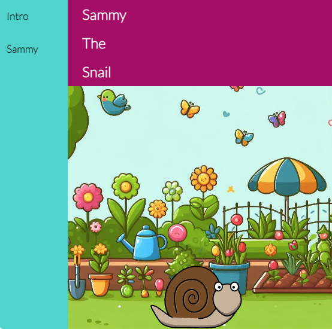

## 简介

在这个项目中，你将使用 HTML、CSS 和 JavaScript 创建一个交互式故事，其中包含用户滚动时触发的动画文本和字符。

网页过去只是静态且无趣的，但现代网站添加了 **互动性** 来吸引浏览者的注意力，并使在线体验更加有趣。 

你将要：

- 跟踪元素的位置
- 设置仅在需要时加载图像
- 创建你自己的 HTML 页面
- 当文本和图像元素进入视口时，为其添加动画效果

\--- no-print ---

\--- task ---

### 尝试一下

  
探索这个动画故事。 

- 向下滚动页面即可观看图像加载
- 点击侧面导航栏上的链接即可查看不同的页面
- 向下滚动页面查看不同的交互功能

<iframe src="https://editor.raspberrypi.org/en/embed/viewer/animated-story-complete" width="100%" height="800" frameborder="0" marginwidth="0" marginheight="0" allowfullscreen> </iframe>

\--- collapse ---

---

## title: 此项目中的图像

使用生成式人工智能创建的花园图像。 Model: Firefly Image 2
蜜蜂图像由 Clker-Free-Vector-Images 通过 Pixabay 提供。
蜻蜓图片由 pixelcreatures 通过 Pixabay 提供。
蝴蝶图片由 MahuaSarkar 通过 Pixabay 提供。
瓢虫图片由 Glamazon 通过 Pixabay 提供。
蜗牛图片：Freeimages.com/openclipart.org
旋转器图片：Iphone-spinner-2 via https://icons8.com/

\--- /collapse ---

\--- /task ---

\--- /no-print ---

\--- print-only ---

\--- /print-only ---
