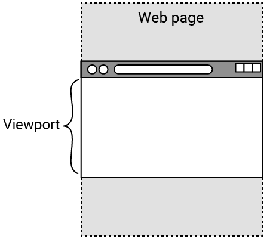
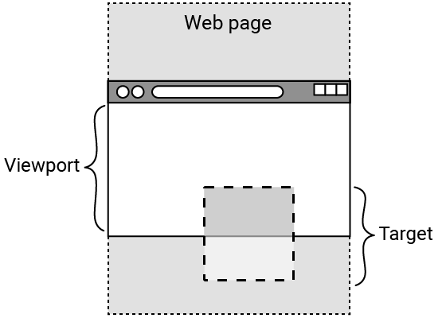

## 观察元素

在此步骤中，你将使用“交叉观察器”使一些文本消失！ 启动项目目前缺少一些元素，但不用担心，你可以在项目进行过程中添加它们。

<iframe src="https://editor.raspberrypi.org/zh-CN/embed/viewer/animated-story-step2" width="100%" height="800" frameborder="0" marginwidth="0" marginheight="0" allowfullscreen> </iframe>

--- task ---

打开 [动画故事入门项目](https://editor.raspberrypi.org/zh-CN/projects/animated-story-starter){:target="_blank"}。

--- /task ---

你的入门项目包含：

- `index.html`：包含图像和文本的 HTML 页面
- `style.css` 和 `default.css`：包含部分内容样式的 CSS 文件
- 你将在项目中使用的图像
- `scripts.js`：您将在整个项目中开发的 JavaScript 文件

### 控制台

--- task ---

打开控制台。

--- /task ---

--- collapse ---

---
title: 打开控制台
---

大多数浏览器都会允许你右键单击页面并“检查”元素。

这将打开开发人员工具，包括控制台。

一些有用的键盘快捷键：

- Chrome：Ctrl + Shift + J（在 Windows 上）或 Cmd + Option + J（在 Mac 上）
- Firefox：Ctrl + Shift + J（在 Windows 上）或 Cmd + Option + K（在 Mac 上）
- Microsoft Edge：Control + Shift + I
- Safari：首先，启用“开发菜单”。 为此，请单击 Mac 菜单栏中的 **Safari**，然后选择 **设置**。 单击**高级**，勾选“显示 Web 开发人员的功能”旁边的复选框，然后关闭窗口。 你现在可以使用 Cmd + Option + C 打开控制台。

--- /collapse ---

JavaScript 观察器可用于监视（“观察”）具有特定 `id` 或 `class` 属性的 HTML 元素集合。

项目集合称为 **数组**。 数组可以包含多个项目或仅包含一个项目。

观察器的一个用途是让浏览器检测元素何时进入视口。

 **视口** 是网页当前在浏览器中可见的区域。

你可以向控制台输出一些内容来查看您的观察器是否正在工作。

### 创建一个名为 bounceObserver 的交叉观察器

--- task ---

打开 `scripts.js` 文件。

创建一个名为 `bounceObserver` 的观察器。

--- code ---
---
language: js
filename: scripts.js
line_numbers: true
line_number_start: 1
line_highlights: 2-4
---

// 隐藏弹跳观察者
const bounceObserver = new IntersectionObserver(

);

// 图像观察器

--- /code ---

**提示：**使用换行符分隔不同的观察器（在本例中为第 5 行）。

--- /task ---

### 告诉 bounceObserver 进行观察

--- task ---

调用 `bounceObserver` 来 `观察` 文档（网页）中带有 `id="hideBounce"` 属性的元素。

\*\*注意：\*\*此元素称为“目标”元素。

观察到的元素被传递给观察器中的 `entries` 数组。

--- code ---
---
language: js
filename: scripts.js
line_numbers: true
line_number_start: 1
line_highlights: 2, 5
---

// 隐藏弹跳观察者
const bounceObserver = new IntersectionObserver((entries)

);
bounceObserver.observe(document.querySelector("#hideBounce"));

// 图像观察器

--- /code ---

**注意：**第 3 行的换行符将包含回调。

 **回调** 是浏览器检测（“观察”）目标元素时运行的代码。

--- /task ---

### 创建回调

--- task ---

箭头语法（`=>`）可以用来代替 `function` 关键字。

--- code ---
---
language: js
filename: scripts.js
line_numbers: true
line_number_start: 1
line_highlights: 2, 4
---

// 隐藏弹跳观察者
const bounceObserver = new IntersectionObserver((entries) => {

});
bounceObserver.observe(document.querySelector("#hideBounce"));

// 图像观察器

--- /code ---

--- /task ---

回调将首先检查 `entries` 数组中的元素（带有属性 `id="hideBounce"`）（目标元素）是否已进入视口。

使用 `isIntersecting` 方法来检查这一点。

此图像显示了已进入浏览器视口的网页上的目标元素。

--- task ---

使用条件语句启动回调。

--- code ---
---
language: js
filename: scripts.js
line_numbers: true
line_number_start: 1
line_highlights: 3-5
---

// 隐藏弹跳观察者
const bounceObserver = new IntersectionObserver((entries) => {
  if (entries[0].isIntersecting) {

  }
});
bounceObserver.observe(document.querySelector("#hideBounce"));

// 图像观察器

--- /code ---

**提示：**条目数组中只有一个元素（索引为 0）。 因此，你可以使用 `entries[0]` 直接访问它。

--- /task ---

### 向控制台输出消息

如果满足条件（属性为 `id="hideBounce"` 的元素进入了视口），则可以使用 `console.log()` 向控制台输出消息进行测试。

--- task ---

当满足 `if` 条件时添加一个操作，向控制台输出测试消息。

--- code ---
---
language: js
filename: scripts.js
line_numbers: true
line_number_start: 1
line_highlights: 4
---

// 隐藏弹跳观察器
const bounceObserver = new IntersectionObserver((entries) => {
  if (entries[0].isIntersecting) {
    console.log("视口中的弹跳触发器");
  }
});
bounceObserver.observe(document.querySelector("#hideBounce"));

// 图像观察器

--- /code ---

**点击运行**

- 打开控制台。
- 向下滚动并查看控制台中出现的“视口中的弹跳触发器”消息。

--- /task ---

--- collapse ---

---
title: 控制台中没有显示任何内容
---
- 检查 `IntersectionObserver` 的拼写。 它应该有两个大写字母。
- 第 4、6 和 7 行末尾必须有一个分号。
- 闭合所有括号和花括号。

--- /collapse ---

--- collapse ---

---
title: bounceObserver 交叉观察器的结构
---

在第 2 行中，`entries` 是网页上所有具有 `id="hideBounce"` 属性的元素的集合。

项目的集合称为“数组”。

设置 `bounceObserver` 来观察 `entries` 数组中第一个（在本例中是唯一一个）目标元素何时进入视口。

当它发生时，观察者“回调”会向控制台输出一条消息。

--- /collapse ---

### 隐藏文本

索引页底部有一些弹跳文本，告诉您“向下滚动”。

--- task ---

**测试：**向下滚动。

你会看到“向下滚动”文本妨碍了其他内容。

--- /task --- 

除了向控制台输出消息之外，你还可以做更多的事情。

你可以通过更改其 `opacity` 属性的值来隐藏弹跳的“向下滚动”文本。

--- task ---

当满足 `if` 条件时添加一个操作，该操作会更改弹跳文本元素的 `opacity` 属性的值，该元素具有属性 `id="bounce"`。

将不透明度值设置为 `0` 以使其不可见。

--- code ---
---
language: js
filename: scripts.js
line_numbers: true
line_number_start: 1
line_highlights: 5
---

// 隐藏弹跳观察器
const bounceObserver = new IntersectionObserver((entries) => {
  if (entries[0].isIntersecting) {
    console.log("视口中的弹跳触发器");
    document.querySelector("#bounce").style.opacity = 0;
  }
});
bounceObserver.observe(document.querySelector("#hideBounce"));

// 图像观察器

--- /code ---

--- /task ---

--- task ---

**点击运行**

- 向下滚动即可看到弹跳文本“向下滚动”消失！

--- /task ---

--- collapse ---

---
title: 弹跳文字不消失
---
- 第 5 行末尾必须有一个分号。
- 请确保你正确拼写 `querySelector`, 包括大写字母！

--- /collapse ---
保存你的项目

你的项目已自动保存。 返回同一 Web 浏览器中的启动链接以查看你的更改。

接下来，你将通过仅在需要时加载图像来提高浏览器性能。
