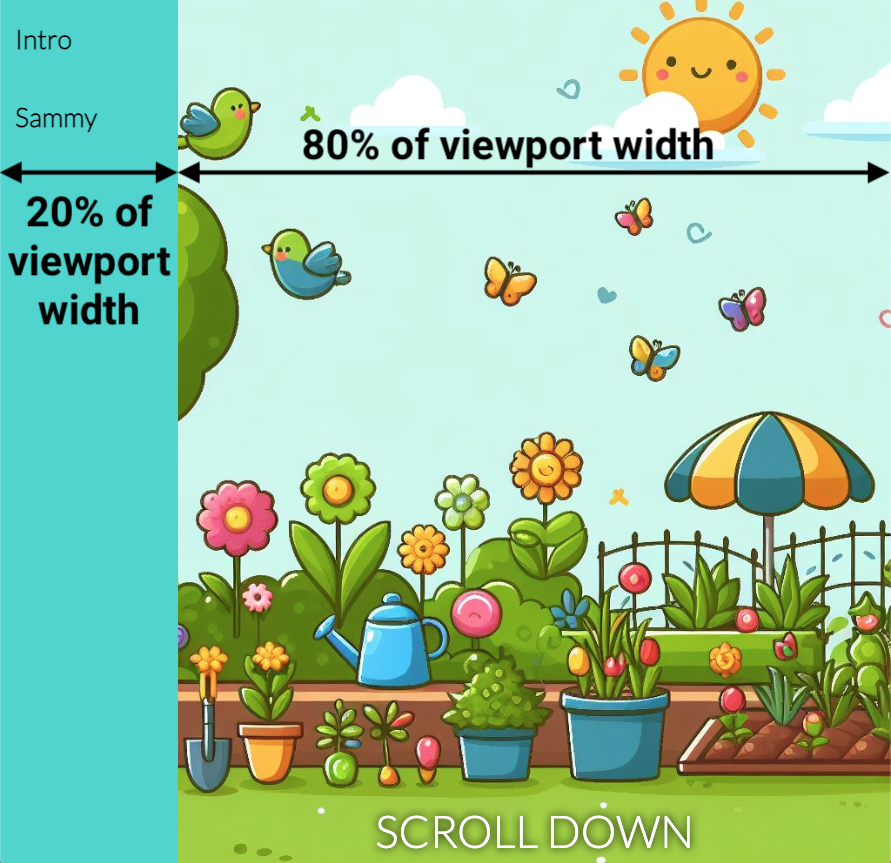
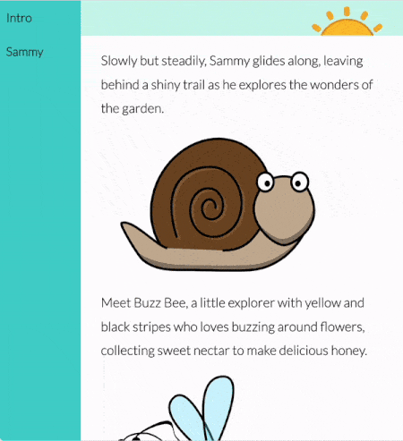

## 添加新页面

在此步骤中，你将向你的网站添加一个新的页面和导航栏（navbar）。

<iframe src="https://editor.raspberrypi.org/zh-CN/embed/viewer/animated-story-step4" width="100%" height="800" frameborder="0" marginwidth="0" marginheight="0" allowfullscreen> </iframe>

### 添加导航栏

如果你已经完成了 [欢迎来到南极洲](https://projects.raspberrypi.org/zh-CN/projects/welcome-to-antarctica) 项目， 你将知道如何创建导航栏。

--- task ---

打开 `index.html` 文件。

找到 `<body>` 标签。

在其下方添加 `<nav>` 标签，其中包含要在导航栏中显示的链接。

--- code ---
---
language: html
filename: index.html
line_numbers: true
line_number_start: 11
line_highlights: 12-15
---

  <body>
    <nav class="navigation">
      <a href="index.html">简介</a>
      <a href="sammy.html">萨米</a>
    </nav>
    <main>

--- /code ---

**点击运行**

- 导航链接将出现在顶部。

--- /task ---

--- collapse ---

---
title: 导航链接不存在
---

- 请确保您将`class="navigation`属性添加到开头的`<nav>`。

--- /collapse ---

### 创建一个新页面

--- task ---

**单击**“+ 添加文件”按钮。

将新文件命名为 `sammy.html` 并单击**添加文件**按钮。

--- /task ---

为了让你开始使用这个新页面，你将使用与 `index` 内容类似的 HTML。

--- task ---

将此内容添加到你的新 `sammy.html` 文件中。

--- code ---
---
language: html
filename: sammy.html
line_numbers: true
line_number_start: 1
---

<!DOCTYPE html>
<html lang="en">
  <head>
    <meta charset="UTF-8" />
    <meta name="viewport" content="width=device-width, initial-scale=1.0" />
    <title>萨米</title>
    <link rel="stylesheet" href="style.css" />
    <link rel="stylesheet" href="default.css" />
  </head>

  <body>
    <nav class="navigation">
      <a href="index.html">简介</a>
      <a href="sammy.html">萨米</a>
    </nav>
    <main>
      <section class="garden">
        
向下滚动

      </section>
    </main>
  </body>
  
</html>

--- /code ---

--- /task ---

### 将导航栏放在左侧

为了让这个网站更像一本书，你可以将导航栏放在左侧。

--- task ---

打开 `style.css` 文件并找到 `.navigation` 选择器。

将 `position` 和 `width` 属性添加到 `.navigation` 选择器。

--- code ---
---
language: css
filename: style.css
line_numbers: true
line_number_start: 82
line_highlights: 92-93
---

/* 导航栏 */

.navigation {
  background-color: var(--navigation-background-color);
  top: 0;
  display: flex;
  flex-direction: column;
  height: 100%;
  font-size: 3cqw;
  font-weight: 900;
  position: fixed;
  width: 20vw;
}

--- /code ---

**点击运行**

- 导航栏应位于左侧。

--- /task ---

“向下滚动”文本不再居中，因为导航栏的样式为 `width: 20vw`，因此占据了视口宽度的 20%。

--- task ---

为 `main` 的样式添加 `padding-left` 属性。

--- code ---
---
language: css
filename: style.css
line_numbers: true
line_number_start: 14
line_highlights: 15
---

main {
  padding-left: 20vw;
}

--- /code ---

--- /task ---

你可以更改元素的宽度，使其延伸至视口宽度的**百分比**。

--- task ---

将 `#bounce` 选择器的宽度属性更改为 `80vw`（视口宽度的 80%）。

--- code ---
---
language: css
filename: style.css
line_numbers: true
line_number_start: 40
line_highlights: 41
---

#bounce {
  width: 80vw;
  position: fixed;
  bottom: 0;
  text-align: center;
  color: var(--text-color);
  font-size: 5cqw;
  text-shadow: 0 0 10px var(--text-shadow-color);
  animation: bounce 1s infinite;
}

--- /code ---

**点击运行**

- “向下滚动”文本应位于中央。

--- /task ---

### 使用容器查询调整字体大小

字体大小当前设置为**固定**大小 50 像素（`50px`）。

你可以使用 `cqh` 而不是 `px` 来计算字体的大小，因此它始终与其容器元素的高度相关。

--- task ---

将 `p` 选择器的 `font-size` 属性更改为 `3cqh`。

--- code ---
---
language: css
filename: style.css
line_numbers: true
line_number_start: 69
line_highlights: 70
---

p {
  font-size: 3cqh;
  padding-left: 5vw;
  padding-right: 5vw;
}

--- /code ---

**点击运行**

- 调整编辑器预览的**高度**以查看字体大小的变化！

--- /task ---

--- collapse ---

---
title: 什么是 cqh？
---

容器查询高度 (cqh) 是指定相对于元素容器元素尺寸的大小的单位。

`1cqh` 是容器高度的 1%。 例如，如果容器的高度为 300px，则属性上的值 `10cqh` 将为 30px。

使用 `cqh` 单位而不是 `px`（像素单位）来调整元素大小的一个好处是元素将随其容器一起调整大小。 这通常发生在你调整浏览器窗口大小或在不同屏幕上查看网页时。

下面是一个示例：

在示例中，主要故事文本的字体大小已设置为使用 `cqh`，因此它会随着浏览器的高度而变化。

导航栏中文本的字体大小已设置为使用 `cqw`，因此它会随着浏览器的宽度而变化。

--- /collapse ---

你的网站看起来棒极了！

接下来，你将为文本添加一个很酷的动画来吸引人们的注意力！
