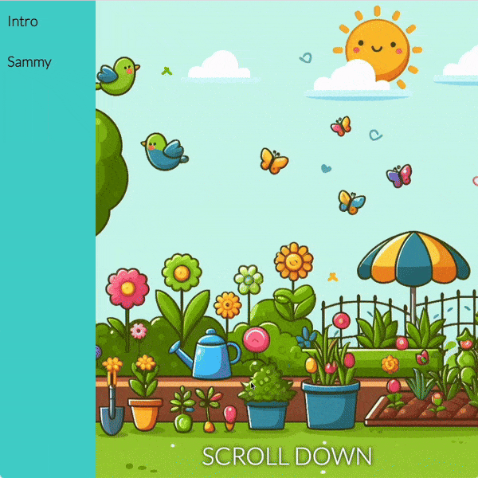

## 动画文本

在此步骤中，你将向文本添加酷炫的动画来吸引人们的注意力！

<iframe src="https://editor.raspberrypi.org/zh-CN/embed/viewer/animated-story-step5?page=sammy.html" width="100%" height="800" frameborder="0" marginwidth="0" marginheight="0" allowfullscreen> </iframe>

### 固定花园图像的位置

你以“固定”花园图像的位置，使其显示为背景，其他内容在其前面滚动。

--- task ---

将 `background-attachment: fixed` 属性添加到 `.garden` 选择器。

--- code ---
---
language: css
filename: style.css
line_numbers: true
line_number_start: 75
line_highlights: 79
---

.garden {
  background-image: url("garden.jpg");
  background-size: cover;
  background-position-y: bottom;
  background-attachment: fixed;
}

--- /code ---

**点击运行**

- 向下滚动即可看到作为固定背景的花园图像。

--- collapse ---

---
title: 我应该看什么？
---

--- /collapse ---

--- /task ---

### 添加标题

你可以使用 `<h1>` 元素为故事页面添加标题。

`<h1>` 元素应该具有属性 `id="hideBounce"`。

--- task ---

打开 `sammy.html` 文件。

找到结束的 `</section>` 标签。

添加 `<h1>` 元素。

--- code ---
---
language: html
filename: sammy.html
line_numbers: true
line_number_start: 16
line_highlights: 20
---

    <main>
      <section class="garden">
        
向下滚动

      </section>
      <h1 id="hideBounce">萨米  蜗牛 </h1>
    </main>

--- /code ---

**点击运行**

- 向下滚动即可看到标题。

--- /task ---

### 添加一些故事文本

--- task ---

在 `<h1>` 标题后添加故事文本。

故事文本应该位于 `
` 元素中。

--- code ---
---
language: html
filename: sammy.html
line_numbers: true
line_number_start: 16
line_highlights: 21-23
---

    <main>
      <section class="garden">
        
向下滚动

      </section>
      <h1 id="hideBounce">萨米  蜗牛 </h1>
      

        在一个阳光明媚的花园里，蜗牛萨米醒来后感到很好奇。   他慢慢地冒险，走出了平常的路径，闪亮的壳闪闪发光。萨米想看看熟悉的树叶和花朵背后有什么。   他滑行时，小小的花园世界仿佛在他面前展开。   萨米发现了一片沾满露水的草地，在晨曦中像钻石一样闪闪发光。他兴奋不已，探索着小隧道和秘密藏身之处。  小蜗牛的冒险让他露出了笑容。萨米意识到，即使在花园最小的角落，也隐藏着秘密。   萨米继续他的探索，渴望在这个繁花似锦的世界中发现更多奇迹。
      

    </main>

--- /code ---

**点击运行**

- 向下滚动即可查看故事文本。

--- /task ---

### 为文本添加动画效果

创建动画以应用于故事文本。

--- task ---

打开 `style.css` 文件。

找到 `/* 动画 */` 注释。

添加一个名为 `rising` 的关键帧动画。

--- code ---
---
language: css
filename: style.css
line_numbers: true
line_number_start: 51
line_highlights: 53-61
---

/* 动画 */

@keyframes rising {
  from {
    transform: translateY(20%);
  }
  to {
    transform: translateY(0%);
  }
}

@keyframes bounce {

--- /code ---

--- /task ---

接下来，创建一个使用 `rising` 动画的新选择器（`.rise`）。

**注意：**稍后，当 `
` 元素进入视口时，你将使用 JavaScript 将 `rise` 类添加到 `
` 元素。

--- task ---

创建 `.rise` 选择器。

--- code ---
---
language: css
filename: style.css
line_numbers: true
line_number_start: 51
line_highlights: 53-56
---

/* 动画 */

.rise {
  animation: rising 2s ease;
}

@keyframes rising {

--- /code ---

选择器设置了一个 `animation` 属性来调用你之前创建的关键帧动画 `rising`。

动画设置为持续两秒（`2s`）并使用 `ease` 过渡。

**提示：**你可以在 CSS 文件中的任何位置添加它，但将其添加到关键帧动画的代码附近是有意义的。

--- /task ---

### 使用 JavaScript 触发动画

`index.html` 上不需要此动画。

你应该创建一个包含此页面所需脚本的新 JavaScript 文件。

--- task ---

创建一个新的 JavaScript 文件，其中包含与 `sammy.html` 相关的脚本。

- **点击**“+ 添加文件”按钮

- 将新文件命名为 `sammy.js` 并单击**添加文件**按钮。

--- /task ---

你需要从 `sammy.html` 页面链接你的新文件。

--- task ---

打开 `sammy.html` 文件。

找到 `

  

--- /code ---

--- /task ---

现在，你将创建一个带有回调的 JavaScript 交叉观察器，当它进入视口时，该回调会将 `rise` 类添加到 `
` 元素。

--- task ---

打开你之前创建的文件 `sammy.js`。

添加一个名为 `riseObserver` 的交叉观察器。

--- code ---
---
language: js
filename: sammy.js
line_numbers: true
line_number_start: 1
line_highlights:
---

// 上升文本观察器
const riseObserver = new IntersectionObserver((entries) => {
  if (entries[0].isIntersecting) {
    entries[0].target.classList.add("rise");
  }
});
riseObserver.observe(document.querySelector("p"));

--- /code ---

**提示：**此交叉观察器与你在之前步骤中创建的 `bounceObserver` 类似。

主要有两个区别：

- `riseObserver` 监视 `
` 元素
- `riseObserver` 为相交元素添加 `rise` 类。

**点击运行**

- 向下滚动即可看到 `
` 文本进入视口时的上升动画。

--- /task ---

接下来，你将向标题添加动画，并向图像添加不同的动画。
