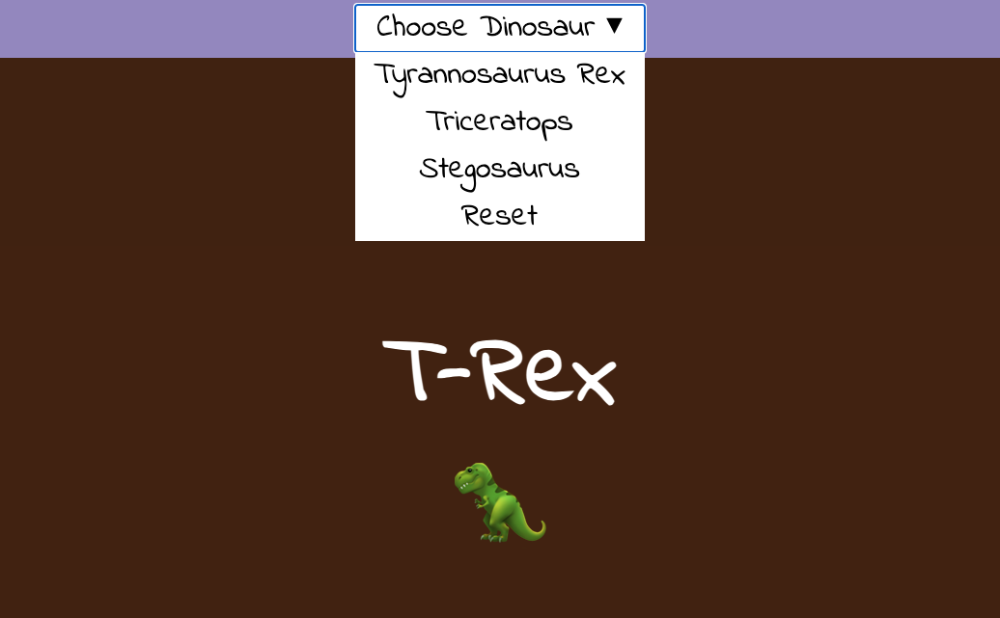

## 接下来是什么？

如果你正在遵循 [更多 Web](https://projects.raspberrypi.org/zh-CN/pathways/more-web) 路径， 你可以转到 [选择你最喜欢的！](https://projects.raspberrypi.org/zh-CN/projects/pick-your-favourite) 项目。 在这个项目中，你将创建一个粉丝网站，让用户可以通过做出选择来改变网页的内容！ 你可以制作一个网页，其中包含有关不同体育队伍、时尚品牌、电视节目或你和你的朋友所喜欢的任何其他内容的内容！

--- print-only ---

--- /print-only ---

--- no-print ---

<iframe src="https://editor.raspberrypi.org/zh-CN/embed/viewer/pick-your-favourite-dinosaur" width="100%" height="800" frameborder="0" marginwidth="0" marginheight="0" allowfullscreen> </iframe>

--- /no-print ---

如果你想在探索 HTML，CSS，JavaScript 中获得更多乐趣，那么你可以尝试[这些项目](https://projects.raspberrypi.org/zh-CN/projects?software%5B%5D=html-css-javascript)。

***

该项目由以下志愿者翻译：

刘璨瑜

正因为志愿者们的辛勤工作，我们才能为世界各地的人们提供用母语来学习的机会。您也可以通过志愿翻译工作来帮助我们吸引更多的人 - 更多信息，请访问[rpf.io/translate](https://rpf.io/translate)。
